# JavaScript Interview Questions and Answers

---

## ❓ What is JavaScript?

JavaScript is a **high-level**, **interpreted**, **single-threaded**, and **synchronous** programming language used to create interactive websites.

It runs in the browser and can also be used on the backend (Node.js).

- **High-level:** Easy to read and write, handles low-level stuff for you.
- **Interpreted:** Runs code line by line in the browser.
- **Single-threaded:** Can do one thing at a time.
- **Synchronous:** Executes code in order, one step after another.

### But JavaScript Can Also Be Asynchronous:

JS uses tools like:

- `setTimeout()`
- **Web APIs**
- **Promises**
- `async/await`

...to run code in the background without blocking.

---

## ❓ What is the History of JavaScript?

JavaScript was created by **Brendan Eich** in **1995** while working at Netscape.

- Originally called **Mocha**, then renamed to **LiveScript**, and finally **JavaScript**.
- It was developed in just **10 days**.
- Despite the name, JavaScript is **not related to Java**.
- Standardized by **ECMA International** as **ECMAScript** in 1997.
- Today, JavaScript is one of the **core technologies of the web** alongside HTML and CSS.

---

## ❓ Is JavaScript a Compiled or Interpreted Language?

First of all let's understand what is:

### What is a JavaScript Engine?

A **JavaScript Engine** is a program that executes JavaScript code.

- **V8** — Used in Chrome and Node.js
- **SpiderMonkey** — Used in Firefox
- **Chakra** — Used in older Microsoft Edge versions

### Is JavaScript Compiled or Interpreted?

Traditionally, **JavaScript is an interpreted language**, meaning:

- Code is executed **line by line**.
- Earlier engines interpreted JS **without converting to machine code ahead of time**.

But **modern JavaScript engines** use **JIT (Just-In-Time) Compilation**, which makes JavaScript **partially compiled** and **partially interpreted**.

```js
console.log("Hello World"); // Runs first
console.log("Hello Again"); // Runs after the first line
```

> So, JavaScript behaves like an interpreted language but with **JIT compilation** to boost performance.

### What is an Abstract Syntax Tree (AST)?

An **Abstract Syntax Tree (AST)** is a tree-like representation of the source code structure.

- Nodes represent constructs like variables, functions, operators, etc.

- AST is used internally by JavaScript engines for:

  - Syntax checking
  - Scope management
  - Code transformation and optimization

### 🆚 Compiled vs Interpreted Languages

| **Feature**    | **Compiled Languages**       | **Interpreted Languages**       |
| -------------- | ---------------------------- | ------------------------------- |
| **Examples**   | C, C++, Rust                 | JavaScript, Python, Ruby        |
| **Execution**  | Pre-compiled to machine code | Line-by-line execution          |
| **Speed**      | Faster after compilation     | Slower at runtime               |
| **Start Time** | Slower to start              | Fast to start                   |
| **Output**     | Machine code                 | Direct execution by interpreter |

### How Modern JavaScript Works (JIT)

Modern engines like **V8** use **Just-In-Time (JIT) Compilation**:

- JS is parsed into an **AST (Abstract Syntax Tree)**
- Then it's compiled into **bytecode**
- "Hot code" (frequently used code) is **optimized into machine code** during runtime

👉 This gives JavaScript the **speed of compiled languages**
while keeping the **flexibility of interpreted ones**

### Analogy

- **Interpreted**: Reading a book out loud word by word without preparation
- **Compiled**: Translating the book entirely before reading
- **JIT**: Reading out loud and translating parts as you go for speed and efficiency

---

## ❓ What Makes JavaScript Great?

JavaScript is popular for a reason. It’s powerful, flexible, and beginner-friendly.

### Key Reasons:

- **Simplicity:**
  Easy to learn, write, and run directly in the browser. No setup needed.

- **Versatility:**
  Works on the **frontend** (browser), **backend** (Node.js), and even in **mobile apps** (React Native).

- **OOP + Functional Programming:**
  Supports both:

  - **Object-Oriented Programming** (classes, objects, inheritance)
  - **Functional Programming** (first-class functions, callbacks)

- **Asynchronous Power:**
  Handles slow tasks like API calls using:

  - Callbacks
  - Promises
  - `async/await`

- **Huge Ecosystem:**
  Massive community, lots of libraries and frameworks like:
  - React
  - Angular
  - Vue

---

## ❓ What Are JavaScript's Weaknesses?

Even though JavaScript is powerful and popular, it has some limitations.

### Key Weaknesses:

- **Security Issues:**
  JavaScript runs on the client side, so it’s exposed to attacks like XSS (Cross-Site Scripting).

- **Browser Dependency:**
  Behavior may vary across browsers due to differences in engine implementations.

- **Single-threaded:**
  It can only do one thing at a time. Heavy tasks can block the UI and make the page unresponsive.

- **Global Scope Pollution:**
  If not carefully managed, too many global variables can cause conflicts.

- **Debugging Async Code:**
  Debugging Promises or `async/await` can be tricky, especially for beginners.

- **Dynamic Typing Confusion:**  
  JavaScript is **dynamically typed**, which can lead to **type coercion bugs**.

  ```js
  console.log(0 == '0');   // ✅ true (type coercion)
  console.log(0 === '0');  // ❌ false (strict equality)
  ```

---

## ❓ What is JSON?

**JSON** stands for **JavaScript Object Notation**

It’s a:

- Lightweight
- Self-descriptive
- Easy-to-read

A **data format used for exchanging data between server and client**

### **JSON only allows double quotes**:

```json
{
  "name": "Ahad Ali"  // ✅ valid JSON
}
```
This is invalid in JSON:
```js
{
  name: 'Ahad Ali'    // ❌ not allowed in JSON
}
```

> JSON is stricter than JS. Keys and string values must use double quotes only.

### JSON Object Example

```json
{
  "name": "Ahad Ali",
  "age": 22,
  "isDeveloper": true,
  "skills": ["JavaScript", "React"],
  "profile": {
    "linkedin": "ahadalireach",
    "location": "Pakistan"
  }
}
```

### `JSON.parse()` — Convert JSON String → JS Object

Use when you **receive JSON from a server** (as a string) and want to convert it to a **JavaScript object**.

```js
const jsonData = '{"name":"Ahad Ali","age":22}';
const obj = JSON.parse(jsonData);

console.log(obj.name); // ✅ "Ahad Ali"
```

- `JSON.parse()` ka use tab hota hai jab string ko JavaScript object mein convert karna ho.

### `JSON.stringify()` — Convert JS Object → JSON String

Use when you want to send data to a server.
Server string hi accept karta hai, is liye object ko string banana padta hai.

```js
const obj = { name: "Ahad Ali", age: 22 };
const jsonString = JSON.stringify(obj);

console.log(jsonString); // ✅ '{"name":"Ahad Ali","age":22}'
```

- `JSON.stringify()` -> se hum JS object ko JSON string bana kar send karte hain.

---

## ❓ What is a Thread of Execution?

A **thread of execution** is the path a program follows while running your code — one line at a time.

In simple terms, a thread is a **single, sequential flow** of instructions.

### In JavaScript:

- JavaScript is **single-threaded**, meaning it has only **one main thread** to execute all code.
- Everything runs **line by line** — one task at a time.
- This thread manages two main things:
  - **Call Stack:** Tracks function calls and execution order.
  - **Memory Heap:** Stores variables and objects.

### In Simple Words:

> It’s **how JavaScript runs your code from top to bottom, one step at a time.**

```js
console.log("1");
console.log("2");
console.log("3");
console.log("4");
```

```
1
2
3
4
```

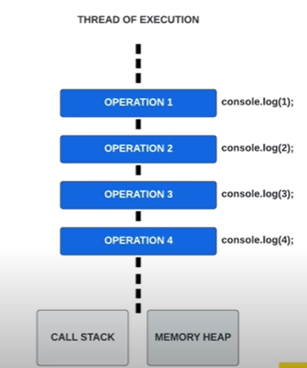

JavaScript executes one statement, then moves to the next — just like reading a book.

---

## ❓ What is the Call Stack?

The **Call Stack** is a data structure that JavaScript uses to **keep track of function calls**.

It follows the **LIFO (Last In, First Out)** principle.
The last function that enters the stack is the first one to finish and be removed.

> The Call Stack is like a **to-do list** for functions.
> JavaScript keeps track of "what to run next" using this stack.

> The call stack manages **function execution one by one**.
> New function calls are added on top. When a function finishes, it's removed from the top.
> The **Global Execution Context** is always at the bottom.

> Any code must go through the **call stack** before it gets executed.

```js
function first() {
  console.log("first...");
  second();
}

function second() {
  console.log("second...");
  third();
}

function third() {
  console.log("third...");
}

// Calling out of order
third();
second();
first();
```

### Step-by-Step Breakdown

1. `third()` is called:

```console
third...
```

- `third()` is pushed to the call stack
- It executes and prints "third..."
- Then it is popped off after execution

2. `second()` is called:

```console
second...
third...
```

- `second()` is pushed to the call stack
- It calls `third()` → `third()` is pushed
- `third()` executes and is popped
- Then `second()` finishes and is popped

3. `first()` is called:

```console
first...
second...
third...
```

- `first()` is pushed to the call stack
- It calls `second()` → pushed
- `second()` calls `third()` → pushed
- Then they finish in reverse:
  - `third()` → popped
  - `second()` → popped
  - `first()` → popped

### How It Works

> Every time a function is called, it is **pushed** onto the **Call Stack**.
> When it finishes, it is **popped off**.

| Before Execution                                      | Nested Calls in Stack                                 |
| ----------------------------------------------------- | ----------------------------------------------------- |
| 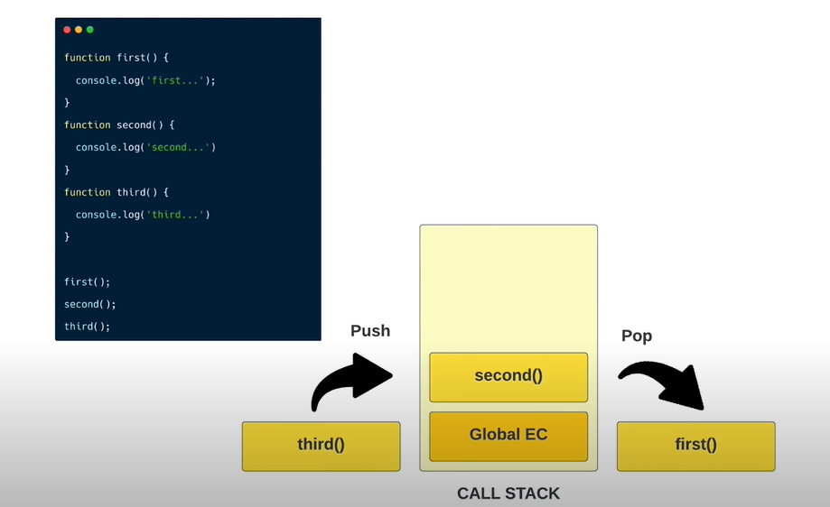 | 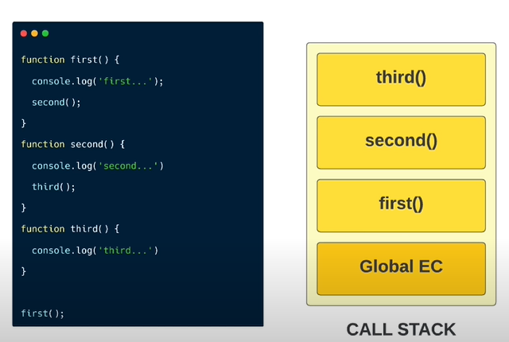 |

---

## ❓ What is Execution Context?

The **Execution Context** is like a **workspace** or **container** where JavaScript runs your code.

Whenever your code runs, a new execution context is created.
This environment handles the **transformation and execution** of your code and contains all the info JavaScript needs to run it properly.

> Everything in JavaScript runs **inside an execution context**.

### Components of Execution Context:

1. **Memory Component (Creation Phase / Variable Environment):**

   - Stores variables and function declarations
   - Sets up the scope chain
   - Binds the `this` keyword

2. **Code Component (Execution Phase / Thread of Execution):**
   - Executes code line-by-line
   - Runs function logic and expressions

### Visual Representation:

<table style="width: 100%;">
  <tr>
    <td style="width: 50%; text-align: center;">
      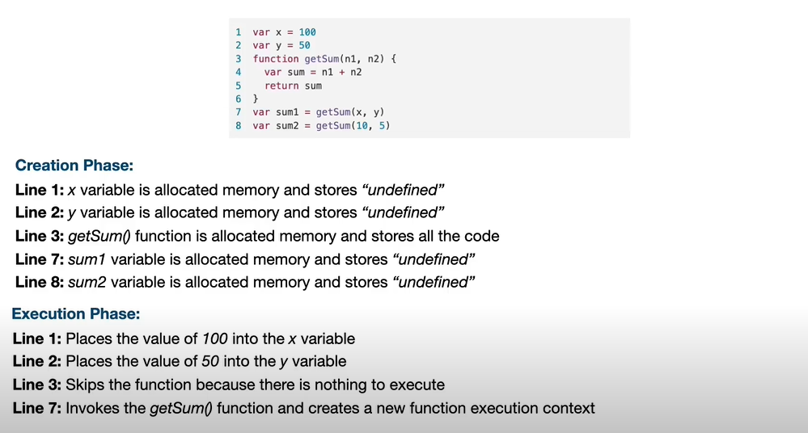
    </td>
    <td style="width: 50%; text-align: center;">
      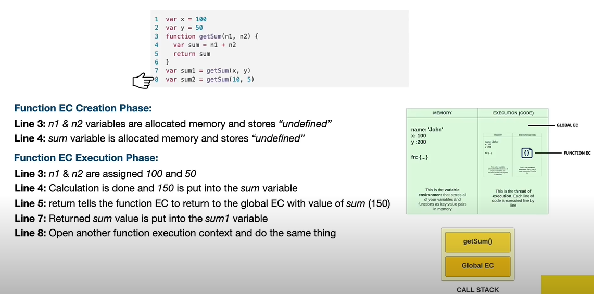
    </td>
  </tr>
</table>

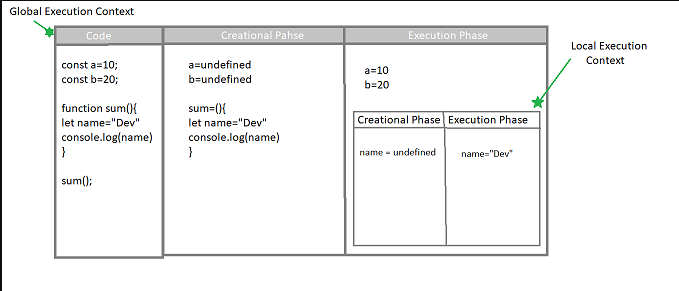


### Types of Execution Context:

- **Global Execution Context (GEC):**

  - Created by default when JavaScript starts executing your file
  - Only one GEC exists at a time

- **Function Execution Context (FEC):**

  - Created **every time a function is called**
  - Each has its own memory and code components

- **Eval Execution Context (EEC):**
  - Rare and created when code is run using `eval()`

> JavaScript uses the **Call Stack** to manage all execution contexts.First, the **Global Execution Context (GEC)** is pushed.Every time a function is called, a new **Function Execution Context (FEC)** is pushed on top.As each function completes, its context is popped off — one by one.

---

## ❓ What is the Global Execution Context (GEC)?

The **Global Execution Context (GEC)** is the first environment created when JavaScript starts running your code.
It represents the **global scope** and provides a base where all global code runs.

- **Created automatically** when the script begins execution
- Stores all **global variables** and **function declarations**
- Sets up the **global object** and binds `this` to it
- Only **one GEC** exists at any given time

### Two Phases of GEC:

1. **Memory Creation Phase (Hoisting):**

   - All variables are allocated memory and initialized with `undefined`
   - Function declarations are stored entirely

2. **Execution Phase:**
   - Code is executed **line-by-line**
   - Variables are assigned actual values

### What is the Global Object?

The **global object** is a special object that holds all global-level variables and functions.

- In **browsers**, it's called `window`
- In **Node.js**, it's called `global`

```js
var a = 10;

console.log(a); // Output: 10
console.log(window.a); // Output: 10 (in browsers)
console.log(global.a); // Output: 10 (in Node.js)
```

> The value of `this` inside the Global Execution Context points to the global object.

---

## ❓ What is Function Execution Context (FEC)?

The **Function Execution Context (FEC)** is created **every time a function is invoked** in JavaScript.
It is a private environment used to run the specific function’s code.

Each FEC contains:

- Arguments object
- Local variable scope
- Reference to outer environment

Each function call creates a new execution context that is:

- **Pushed onto the call stack**
- **Executed**
- **Popped off** once the function completes

> This context is **temporary** and exists only during the lifetime of the function execution.

```js
let a = 10; // Global variable
let b = 20; // Global variable

function add(a, b) {
  return a + b; // Executes inside FEC
}

let result = add(a, b); // Creates FEC
console.log(result); // Output: 30
```

> Each function runs in its own **isolated context** and then returns control back to the previous context (usually GEC).

---

## ❓ What is Eval Execution Context (EEC)?

The **Eval Execution Context (EEC)** is created whenever JavaScript runs code using the `eval()` function.

It behaves similarly to other execution contexts, with its own memory and execution phase, but is considered dangerous and discouraged.

- Created when `eval()` is used to **execute a string of code**
- Has its own **execution context and variable environment**
- Can introduce or override global variables
- **Rarely used** due to **security** and **performance** issues

```js
eval("var a = 10;"); // Creates Eval Execution Context
console.log(a); // Output: 10 (in global scope)
```

> ⚠️ Avoid using `eval()` in production. It can lead to vulnerabilities and unpredictable behavior.

---

## ❓ What is Scope? What are its Types?

Scope determines where variables can be **accessed** in your code.
It defines the **visibility** and **lifetime** of variables.

> The region where we can access the variable is known as the scope for that variable.

### JavaScript supports 4 types of scope:

- **Global Scope**
- **Function Scope**
- **Block Scope**
- **Module Scope**

### Global Scope:

- Variables declared **outside** of any function or block are in the global scope
- Accessible throughout the file and other files (if attached to the global object)
- In the browser, the global object is `window`; in Node.js, it's `global`

```js
var a = 10;
console.log(window.a); // 10 in browser
```

```js
function sayHi() {
  console.log(this); // refers to window in non-strict mode
}
```

### Module Scope:

- Each JavaScript module (using `import`/`export`) has its own scope
- Variables/functions declared in a module are not global unless explicitly exported

```js
// index.js
export const name = "Ahad Ali";

// app.js
import { name } from "./index.js";
console.log(name);
```

### Function Scope:

- Each time a function is called, a new scope is created
- Variables declared with `var` inside functions are scoped to that function

```js
function sayHi(name) {
  var greeting = "Hi " + name;
  return greeting;
}

console.log(sayHi("Ahad Ali"));
```

### Block Scope:

- Introduced with ES6 using `let` and `const`
- Variables declared inside `{}` (e.g. in `if`, `for`) are block-scoped

```js
{
  let x = 5;
  const y = 10;
  console.log(x, y);
}
// x and y are not accessible here
```

> Always prefer `let` and `const` for safer, block-scoped variables.

---

## ❓ What is Scope Chain, Lexical Scope, and Lexical Environment?

### Scope Chain

The **Scope Chain** is the process JavaScript uses to **resolve variable names**.

- When a variable is referenced, the JS engine looks in the **current scope**.
- If not found, it goes **upward** to the **parent scopes**, all the way to the **global scope**.
- This forms a "chain" of scopes.

```js
let a = 10;

function outer() {
  let b = 20;

  function inner() {
    let c = 30;
    console.log(a); // ✅ 10 (from global scope)
    console.log(b); // ✅ 20 (from outer)
    console.log(c); // ✅ 30 (own scope)
  }

  inner();
}

outer();
```

> Scope Chain Order:

- Inner function scope
- Outer function scope
- Global scope

`OR`

**Scope chain** is how JavaScript looks for variables:
👉 If a variable is not found in the current scope, JS looks outward in the parent scope — until it reaches the global scope.

```js
let a = "Global";

function outer() {
  let b = "Outer";

  function inner() {
    let c = "Inner";
    console.log(a); // ✅ Looks in global
    console.log(b); // ✅ Looks in outer
    console.log(c); // ✅ Local
  }

  inner();
}

outer();
```

> Concept: The inner function has access to variables of its outer functions due to scope chain.

### Lexical Scope

**Lexical Scope** (also called static scope) means:

- A variable's accessibility is determined by its position in the source code, not where it is called.
- Functions defined inside other functions can access variables from their outer scopes.

```js
let globalVar = "Global";

function outerFunction() {
  let outerVar = "Outer";

  function innerFunction() {
    console.log(globalVar); // ✅ Accesses global
    console.log(outerVar); // ✅ Accesses outer
  }

  innerFunction();
}

outerFunction();
```

> Lexical scope is set when you write the function, not when you call it.

`OR`

Lexical scope ka matlab hai:

- "Function kis jagah likha gaya hai, uss jagah ke variables us function ke liye available honge."
- Yeh likhne ke waqt decide hota hai, run-time par nahi.

**Easy Explanation:**
Agar koi function kisi aur function ke andar likha ho, to wo apne parent function ke variables ko access kar sakta hai, even agar wo baad mein kahin aur call ho.

```js
function outer() {
  let name = "Ahad Ali"; // 👈 outer scope variable

  function inner() {
    console.log(name); // ✅ Accesses outer's variable
  }

  return inner; // 👈 inner function ko return kar dia
}

const greet = outer(); // outer() run hoke inner() return hua
greet(); // inner() run hua
```

**Kya hua yahaan?**

- `inner()` function outer ke andar likha gaya tha.
- To usko outer ka variable name mil gaya.
- Chahe `inner()` function baad mein kahin aur se call ho — scope wahi hoga jahan wo likha gaya tha.

### Lexical Environment

A **Lexical Environment** is an internal structure used by JS to track identifiers (variables/functions) during execution.
`OR`
A **Lexical Environment** is a concept used by JS engine to manage scope.

> Every time a function is called, a new Lexical Environment is created for it.

**Components:**

- Environment Record – Stores variable/function declarations
- Outer Environment Reference – Links to the parent Lexical Environment

```js
function sum(x) {
  return function (y) {
    return x + y;
  };
}

const add5 = sum(5); // x = 5 in this Lexical Environment
console.log(add5(10)); // 15
```

- Here, the inner function remembers `x = 5` even after sum has finished running, because of the lexical environment.

`OR`

Jab **JavaScript** koi function run karti hai, wo ek box banati hai (Environment) jisme:

- Saare variables store hote hain
- Aur reference hota hai outer scope ka (scope chain)

> Is box ko Lexical Environment kehte hain.

```js
function sum(x) {
  return function (y) {
    return x + y;
  };
}

const add5 = sum(5); // yahan ek LE bana jisme x = 5
console.log(add5(10)); // 15 ➡ y = 10, x = 5 already remembered
```

- `sum(5)` jab call hota hai, JS ek Lexical Environment banata hai jisme:
  - ` x = 5``
  - aur ek inner function store hota hai
- Jab `add5(10)`call hota hai:
  - `y = 10`hota hai
  - but`x = 5` already saved tha pehle se (due to lexical environment)

> **Lexical Scoping** “Access Rules”
> **Lexical Environment** — “Runtime Storage”

| Concept             | Explanation                                                                  |
| ------------------- | ---------------------------------------------------------------------------- |
| Scope Chain         | JS searches for a variable from current → outer → global scope               |
| Lexical Scope       | Scope is based on **where** a function is **written**, not where it’s called |
| Lexical Environment | Behind-the-scenes structure: record of variables + link to parent scope      |

### Real-World Analogy

> **Scope Chain** = "Search path for variables"
> **Lexical Scope** = "Where the function is written decides what it sees"
> **Lexical Environment** = "Notebook that tracks variables + a link to its parent notebook"

---

## ❓ What is Closure?

> A **closure** is a function that retains access to its outer function's variables even after the outer function has completed execution.

In simple terms:

- A function “remembers” the scope in which it was created.
- Even after the outer function is done executing, the inner function still has access to the variables of the outer function.

> A closure is a combination of a function and its **lexical environment** (the variables in scope when the function was created).

### How Closure Works?

```js
// Simple Closure
function makeCounter() {
  let count = 0;
  return function () {
    count++;
    return count;
  };
}

const counter = makeCounter();
console.log(counter()); // 1
console.log(counter()); // 2
console.log(counter()); // 3
```

- The inner function “remembers” count from its `outer` lexical environment.
- Even though `makeCounter()` has finished executing, `count` is still accessible.

### Real-World Example: Button Counter

```js
function initCounter(id) {
  let count = 0;
  return function () {
    count++;
    document.getElementById(id).innerText = count;
  };
}

let counter1 = initCounter("btnCount1");
let counter2 = initCounter("btnCount2");
```

```html
<button onclick="counter1()">1</button>
<p id="btnCount1"></p>

<button onclick="counter2()">2</button>
<p id="btnCount2"></p>
```

- Each button click updates a **private counter**, and both counters are independent.

### Real-World Example: String Appender

```js
function initAddString(inputId, outputId) {
  let str = "";
  return function () {
    str += " " + document.getElementById(inputId).value;
    document.getElementById(inputId).value = "";
    document.getElementById(outputId).innerText = str;
  };
}

let strAdder1 = initAddString("text1", "text-output1");
let strAdder2 = initAddString("text2", "text-output2");
```

```html
<input type="text" id="text1" />
<button onclick="strAdder1()">Add String</button>
<p id="text-output1"></p>

<input type="text" id="text2" />
<button onclick="strAdder2()">Add String</button>
<p id="text-output2"></p>
```

- Each button maintains its own string state separately using closures.

### Advantages of Closures:

1. **Data Privacy**

Closures enable private variables that are not accessible from outside.

```js
function privateCounter() {
  let count = 0;

  function incrementCount() {
    return count++;
  }

  function getCount() {
    return count;
  }

  return { incrementCount, getCount };
}

let counter = privateCounter();
console.log(counter.getCount()); // 0
counter.incrementCount();
console.log(counter.getCount()); // 1
```

2. **Maintain State**

Functions can remember their outer scope, allowing state to persist.

```js
function call() {
  let time = 1;

  function timer() {
    return time++;
  }

  return timer;
}

let timer = call();
console.log(timer()); // 1
console.log(timer()); // 2
console.log(timer()); // 3
```

3. **Factorize Functions**

Closures help create functions that remember and use values across calls. `OR` Closures allow you to create customized functions.

```js
function multiplier(factor) {
  return function (num) {
    return factor * num;
  };
}

let double = multiplier(2);
let triple = multiplier(3);

console.log(double(10)); // 20
console.log(triple(10)); // 30
```

### Disadvantages of Closures:

1. **Memory Consumption**

Closures retain references to their outer scope, which can increase memory usage if not managed well.

2. **Performance Issues**

Excessive use of closures may reduce performance due to increased memory usage.

3. **Debugging Challenges**

Closures can complicate debugging due to complex scope chains.

> Closure = (Inner) Function + Outer Variables (Preserved)

---

## ❕ Bonus Question

### ❓ Question: How can you optimize this expensive function?

You're given the following code:

```js
const clumsySquare = (num1, num2) => {
  for (let i = 1; i <= 100000000; i++) {} // simulate heavy processing
  return num1 * num2;
};
```

**Problem:**
- The function takes a long time to run due to the artificial delay.
- Calling it repeatedly with the **same arguments** will re-run the delay every time.

#### How can you make it faster?
**💡 Solution: Use Memoization**

> Memoization caches the result for a given set of inputs,
> so if you call the function again with the same arguments,
> it returns the cached result instantly, skipping recomputation.

**Memoized Version**
```js
function myMemoize(fn, context) {
  const res = {}; // cache storage
  return function (...args) {
    const argsCache = JSON.stringify(args); // key from args
    if (!res[argsCache]) {
      console.log("Calculating...", args);
      res[argsCache] = fn.apply(context || this, args);
    }
    return res[argsCache];
  };
}
```
```js
// Apply Memoization to clumsySquare
const clumsySquare = (num1, num2) => {
  for (let i = 1; i <= 100000000; i++) {} // simulate heavy work
  return num1 * num2;
};

const memoizedSquare = myMemoize(clumsySquare);
console.time("First call");
console.log(memoizedSquare(9467, 7649)); // Slow: runs the loop
console.timeEnd("First call");

console.time("Second call");
console.log(memoizedSquare(9467, 7649)); // Fast: returns cached result
console.timeEnd("Second call");

```

- 🐌 Without memoization: Every call does expensive work
- ⚡ With memoization: Repeated calls are near-instant
- 👏 A simple yet powerful optimization using closures + lexical scope

---

## ❓ How Does Memory Management Work in JavaScript?

JavaScript handles memory using two main components:

- **Stack**: For static, fixed-size data (primitive types)
- **Heap**: For dynamic, complex data (reference types)

### Stack Memory (for Primitive Types)

**Stores:**

- Numbers, strings, booleans, `undefined`, `null`, `symbol`
- Local variables and function calls

**Characteristics:**

- Fast memory access (LIFO - Last In First Out)
- Memory is allocated linearly
- Values are copied (changes do not affect other variables)
- Automatically managed during function execution

```js
let num = 10; // Primitive stored in stack
let str = "Hello"; // Primitive stored in stack

function add(x, y) {
  let sum = x + y; // Local variables stored in stack
  return sum;
}
```

### Heap Memory (for Reference Types)

**Stores:**

- `Objects`, `arrays`, and `functions` (non-primitive types)

**Characteristics:**

- Memory allocated non-linearly
- Variables store references (not actual data)
- Slower access than stack
- Changes via one reference affect all others pointing to the same object

```js
let user = { name: "Ahad Ali", age: 25 }; // Stored in heap
let arr = [1, 2, 3]; // Stored in heap

let obj1 = { value: 10 };
let obj2 = obj1; // Both point to the same object

obj1.value = 20;

console.log(obj2.value); // 20 (both refer to the same object)
```

### Garbage Collection

**JavaScript engines (like V8)** use automatic garbage collection to manage memory.

- Mark-and-Sweep Algorithm: Removes objects that are no longer accessible or referenced
- Unreachable memory is cleaned up to free space
- Developers don't manually manage memory — it's handled behind the scenes

> If an object or value is no longer reachable from the root (window or global), it's marked as garbage and removed.

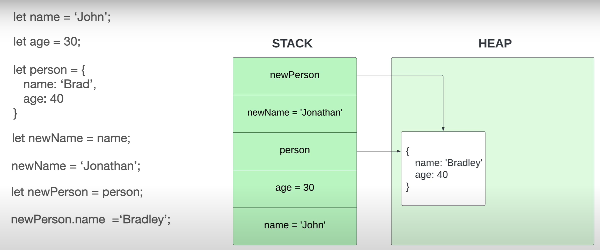

---

## ❓ What is the Difference between `var`, `let`, and `const` in JavaScript?

JavaScript provides three ways to declare variables: `var`, `let`, and `const`.

Each behaves differently in terms of:

- Scope
- Hoisting
- Redeclaration
- Reassignment
- Temporal Dead Zone (TDZ)
- Use cases

### var

- Function-scoped
- Can be redeclared and reassigned
- Hoisted and initialized with `undefined`
- Avoid in modern JavaScript due to confusing scope behavior

```js
function testVar() {
  if (true) {
    var x = 10;
  }
  console.log(x); // ✅ 10 (accessible outside the block)
}
testVar();
```

```js
// Hoisted and initialized with undefined
console.log(a); // ✅ undefined
var a = 5;
```

```js
// Can be redeclared in the same scope
var d = 100;
var d = 200; // ✅ No error
console.log(d); // 200
```

```js
// Can be reassigned
var g = 10;
g = 20; // ✅
console.log(g); // 20
```

```js
// No TDZ (initialized as undefined)
console.log(j); // ✅ undefined
var j = 5;
```

### let

- Block-scoped
- Cannot be redeclared in the same scope
- Can be reassigned
- Hoisted but not initialized (Temporal Dead Zone applies)

```js
function testLetConst() {
  if (true) {
    let y = 20;
  }
  console.log(y); // ❌ ReferenceError
}
testLetConst();
```

```js
// Hoisted but not initialized (TDZ)
console.log(b); // ❌ ReferenceError
let b = 10;
```

```js
// Cannot be redeclared in the same scope
let e = 1;
let e = 2; // ❌ SyntaxError: Identifier 'e' has already been declared
```

```js
// Can be reassigned
let h = 30;
h = 40; // ✅
console.log(h); // 40
```

```js
// TDZ applies (not accessible before declaration)
console.log(k); // ❌ ReferenceError
let k = 10;
```

### const

- Block-scoped
- Cannot be redeclared or reassigned
- Must be initialized at the time of declaration
- Also subject to Temporal Dead Zone

```js
function testLetConst() {
  if (true) {
    const z = 30;
  }
  console.log(z); // ❌ ReferenceError
}
testLetConst();
```

```js
// Hoisted but not initialized (TDZ)
console.log(c); // ❌ ReferenceError
const c = 15;
```

```js
// Cannot be redeclared in the same scope
const f = 3;
const f = 4; // ❌ SyntaxError
```

```js
// Cannot be reassigned
const i = 50;
i = 60; // ❌ TypeError: Assignment to constant variable
```

```js
// TDZ applies (not accessible before declaration)
console.log(l); // ❌ ReferenceError
const l = 15;
```

> ⚠️ However, `objects` and `arrays` declared with const can be mutated

```js
const obj = { name: "Ahad Ali" };
obj.name = "Abdul Ahad"; // ✅ Allowed
console.log(obj.name); // "Abdul Ahad"
```

### Use Cases

| Keyword | Best Use                                             |
| ------- | ---------------------------------------------------- |
| `var`   | ❌ Avoid in modern code                              |
| `let`   | ✅ When variable needs to change                     |
| `const` | ✅ For constants or when you don't want reassignment |

```js
const API_KEY = "123-abc"; // ✅ Use const for constants
let score = 0; // ✅ Use let if score may change
```

---

## ❓ What is Hoisting?

Hoisting is a JavaScript behavior where variable and function declarations are moved to the top of their scope during the creation phase, allowing them to be accessed before being defined in the code.

`OR`

**Hoisting** is JavaScript's behavior of moving **declarations** (not initializations) to the top of their scope before execution.

- Works with both variables and functions
- Variables declared with `var` are hoisted and set to `undefined`
- `let` and `const` are hoisted but not initialized (Temporal Dead Zone applies)
- Function declarations are fully hoisted

```js
greet(); // ✅ "Hi"

function greet() {
  console.log("Hi");
}
```

```
console.log(a); // ✅ undefined
var a = 10;
```

```js
console.log(b); // ❌ ReferenceError
let b = 20;
```

> Only declarations are hoisted — initializations stay in place.

---

## ❓ What is the Behaviour of hoisting in case of `var`, `let`, and `const` in JavaScript?

| Declaration | Hoisted | Initialized  | Scope    | TDZ Applies |
| ----------- | ------- | ------------ | -------- | ----------- |
| var         | ✅ Yes  | ✅ undefined | Function | ❌ No       |
| let         | ✅ Yes  | ❌ No        | Block    | ✅ Yes      |
| const       | ✅ Yes  | ❌ No        | Block    | ✅ Yes      |

```js
console.log(x); // ✅ undefined
var x = 10;
```

```js
console.log(y); // ❌ ReferenceError
let y = 20;
```

```js
console.log(z); // ❌ ReferenceError
const z = 30;
```

> `let` and `const` exist in memory during hoisting but cannot be accessed — this is called the Temporal Dead Zone (TDZ).

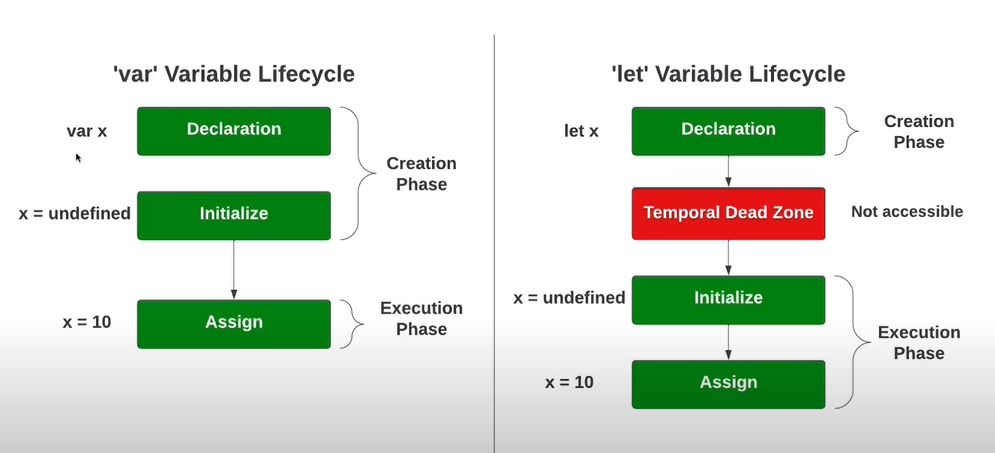

---

## ❓ What is Temporal Dead Zone (TDZ)?

The **Temporal Dead Zone (TDZ)** is the time between variable hoisting and its declaration/initialization in code.

- Applies to `let` and `const`
- Does not apply to `var`
- Variable exists in memory but cannot be accessed yet

```js
x = 30; // ❌ ReferenceError
console.log(x); // ❌ ReferenceError
let x = 10; // ✅ x declared and initialized
```

> TDZ is "temporal" because it depends on the time of execution, not the position of code.

- Prevents accessing variables before intentional initialization
- Helps catch bugs in larger codebases

---

## ❓ What is Variable Shadowing?

**Variable shadowing** occurs when a variable declared in an inner scope (e.g., inside a block or function) has the **same name** as a variable in an outer scope. The inner variable **"shadows"** the outer one, making it inaccessible within that inner scope.

```js
let x = 0; // Outer variable (shadowed)
{
  let x = 1; // Inner variable (shadows the outer x)
  console.log(x); // ✅ 1 (refers to inner x)
}
console.log(x); // ✅ 0 (refers to outer x again)
```

> ⚠️ Shadowing only affects visibility within the inner scope.

```js
// Function Scope Example
let message = "Hello";

function greet() {
  let message = "Hi"; // Shadows the outer 'message'
  console.log(message); // ✅ "Hi"
}

greet();
console.log(message); // ✅ "Hello"
```

## ❓ What are Functions and there types in JavaScript?

Functions in JavaScript are blocks of reusable code that perform a specific task.

### Types of Functions in JavaScript:

- Normal (Named) Functions
- Arrow Functions
- Function Expressions
- Anonymous Functions
- First-Class Functions
- Call-Back Functions
- Pure Functions

---

## ❓ What is the Difference between Normal Function and Arrow Function?

1. Syntax

```javascript
// Normal Function
function add(a, b) {
  return a + b;
}
```

```javascript
// Arrow Function
const add = (a, b) => a + b;

(a) => {
  return a; // Explicit Return, Multi-Line
};

(a) => a; // Implicit Return, Single-Line

(a) => a; // Implicit Return, Multi-Line

(a, b) => a + b; // Multiple Parameters (Parentheses Required)
```

2. Return Behavior

- **Normal Functions**: Always require the `return` keyword to return a value.
- **Arrow Functions**: Allow implicit returns where the `return` keyword can be omitted for single-line expressions.

```javascript
// Normal Function
function multiply(a, b) {
  return a * b; // Explicit Return
}

// Arrow Function
const multiply = (a, b) => a * b; // Implicit Return
```

3. Arguments Object

- **Normal Functions**: Have access to the `arguments` object, which contains the arguments passed to the function.
- **Arrow Functions**: Do not have their own `arguments` object.

```javascript
// Normal Function
function printArguments() {
  console.log(arguments);
}
printArguments(1, 2, 3); // Output: [1, 2, 3]

// Arrow Function
const printArguments = () => {
  console.log(arguments);
};
printArguments(1, 2, 3); // Error: 'arguments' is not defined
```

4. `this` Binding

- **Normal Functions**: Create their own `this` context, which depends on how the function is called.
- **Arrow Functions**: Do not create their own `this` context; they inherit `this` from the surrounding scope.

```javascript
// Normal Function
const obj1 = {
  name: "Normal Function",
  print: function () {
    console.log(this);
  },
};
obj1.print(); // Logs the obj1 object

// Arrow Function
const obj2 = {
  name: "Arrow Function",
  print: () => {
    console.log(this);
  },
};
obj2.print(); // Logs the global 'window' object (or 'undefined' in strict mode)
```

5. Constructors

- **Normal Functions**: Can be used as constructors with the `new` keyword.
- **Arrow Functions**: Cannot be used as constructors and will throw an error if used with `new`.

```javascript
// Normal Function as Constructor
function Person(name) {
  this.name = name;
}
const person1 = new Person("Abdul Ahad"); // Works

// Arrow Function as Constructor
const Person = (name) => {
  this.name = name;
};
const person2 = new Person("Abdul Ahad"); // Error: Person is not a constructor
```

6. Hoisting

- **Normal Functions**: Can be declared and are hoisted to the top of their scope.
- **Arrow Functions**: Cannot be accessed before initialization.

```javascript
// Normal Function
console.log(add(2, 3)); // Works
function add(a, b) {
  return a + b;
}

// Arrow Function
console.log(subtract(5, 2)); // Error: Cannot access 'subtract' before initialization
const subtract = (a, b) => a - b;
```

7. Declaration

- **Normal Functions**: Can be declared using the `function` keyword.
- **Arrow Functions**: Must always be assigned to a variable or constant.

```javascript
// Normal Function Declaration
function greet() {
  console.log("Hello!");
}

// Arrow Function Assignment
const greet = () => {
  console.log("Hello!");
};
```

| **Feature**          | **Normal Function**          | **Arrow Function**              |
| -------------------- | ---------------------------- | ------------------------------- |
| **Syntax**           | `function add(a, b) { ... }` | `const add = (a, b) => { ... }` |
| **Return**           | Explicit Return Required     | Allows Implicit Return          |
| **arguments Object** | Available                    | Not Available                   |
| **this Binding**     | Creates Own `this`           | Inherits `this`                 |
| **Constructor**      | Can Be Used                  | Cannot Be Used                  |
| **Hoisting**         | Fully Hoisted                | Not Hoisted                     |
| **Declaration**      | Using function keyword       | Must Be Assigned to Variable    |

---

## ❓ What is the Difference Between Function Expression and Anonymous Function?

1. Function Expression
   A **Function Expression** is when you define a function and store it in a variable. You can use the variable to call the function later.

- The function expression can be:
- **Anonymous** (no name).
- **Named** (optional name).
- It’s **not hoisted**, so you cannot use it before defining it.

```javascript
// Function stored in a variable
let add = function (a, b) {
  return a + b;
};
console.log(add(10, 20)); // Output: 30

// Function with a name stored in a variable
const multiply = function multiplyNumbers(a, b) {
  return a * b;
};
console.log(multiply(10, 20)); // Output: 200
```

2. Anonymous Function
   An **Anonymous Function** is a function without a name. It’s commonly used for one-time tasks, like in event handlers or `setTimeout`.

- Typically used when you don’t need to reuse the function elsewhere.

```javascript
setTimeout(function () {
  console.log("Hello, I am an Anonymous Function!");
}, 1000);
```

3. Function Declaration
   A **Function Declaration** is the traditional way to define reusable functions in JavaScript.

- Starts with the function keyword.
- Always has a name.
- Hoisted: You can call the function even before it’s defined in the code.

```javascript
function addNumbers(a, b) {
  return a + b;
}
console.log(addNumbers(5, 15)); // Output: 20
```

| Feature         | Function Expression | Anonymous Function | Function Declaration |
| --------------- | ------------------- | ------------------ | -------------------- |
| **Name**        | Optional            | Not present        | Always present       |
| **Hoisting**    | No                  | No                 | Yes                  |
| **Reusability** | Yes                 | No                 | Yes                  |

---

## ❓ What is a First-Class Function?

In JavaScript, functions are treated like values. You can:

- Store them in variables.
- Pass them as arguments to other functions.
- Return them from other functions.
- Store them in objects and arrays.

This concept is called **First-Class Functions**.

1. Store a Function in a Variable
   You can define a function and save it in a variable.

```javascript
let add = function (a, b) {
  return a + b;
};
console.log(add(10, 20)); // Output: 30
```

2. Pass a Function as an Argument
   Functions can be passed as arguments to other functions. This allows for dynamic behavior based on the function passed.

```javascript
function sayHello() {
  return "Hello, ";
}
function executeFunction(callback) {
  return callback() + "World";
}
console.log(executeFunction(sayHello)); // Output: Hello, World
```

3. Return a Function from Another Function
   Functions can generate and return other functions, allowing for closures and reusable logic.

```javascript
function outerFunction() {
  function innerFunction() {
    return "Hello, World";
  }
  return innerFunction;
}
let inner = outerFunction();
console.log(inner()); // Output: Hello, World
```

4. Store Functions in Arrays and Objects
   Functions can be stored as elements in arrays or as properties in objects. This makes it easy to organize and execute specific tasks.

```javascript
const operations = [
  function (a, b) {
    return a + b;
  }, // Addition
  function (a, b) {
    return a * b;
  }, // Multiplication
];

console.log(operations[0](2, 3)); // Output: 5
console.log(operations[1](2, 3)); // Output: 6
```

```javascript
const calculator = {
  add: function (a, b) {
    return a + b;
  },
  subtract: function (a, b) {
    return a - b;
  },
};

console.log(calculator.add(3, 2)); // Output: 5
console.log(calculator.subtract(3, 2)); // Output: 1
```

> First-Class Functions = Functions that can be treated like values

---

## ❓ What is a Callback Function?

> A callback function is a function passed as an argument to another function that gets executed later, often after some operation completes.

Use Cases:

- Asynchronous operations (setTimeout, API calls, DOM events)
- Functional programming patterns

```js
// Simple Callback Example
function greet(name, callback) {
  console.log("Hi " + name);
  callback();
}

function askQuestion() {
  console.log("How are you?");
}

greet("Ahad Ali", askQuestion);
// Output:
// Hi Ahad Ali
// How are you?
```

```js
// setTimeout with Callback
setTimeout(function () {
  console.log("Executed after 2 seconds");
}, 2000);
```

```js
// Array Method Example
const nums = [1, 2, 3];
nums.forEach(function (num) {
  console.log(num * 2); // 2, 4, 6
});
```

```js
// Custom Callback Logic
function doSomething(callback) {
  console.log("Doing something...");
  callback("Task done");
}

doSomething(function (msg) {
  console.log(msg); // Task done
});
```

### Why Use Callback Functions?

- To handle asynchronous logic
- To customize behavior dynamically
- To keep code flexible and modular

> A callback lets one function defer control to another function.

---

## ❓ What is a Pure Function?

A **pure function**:

- Depends only on its **input arguments**
- Has **no side effects**
- Always returns the **same output** for the same input

```js
 // (Pure):
function add(a, b) {
  return a + b;
}

// ❌ Not Pure:
let total = 0;
function addToTotal(a) {
  total += a; // modifies external state (side effect)
}
```

---

## ❓ What is IIFE (Immediately Invoked Function Expression)?

An **IIFE (Immediately Invoked Function Expression)** is a JavaScript function that runs **immediately after it is defined**.

It’s a function that executes itself.

```js
(function () {
  // code here
})();
```

### Types of IIFE

1. Anonymous Function IIFE
   An IIFE without a name that runs immediately.

   ```js
   (function () {
     console.log("Hello, I am an Anonymous function IIFE!");
   })();
   ```

   **Arrow function version:**

   ```js
   (() => console.log("Hello, I am an Anonymous function IIFE!"))(); // Alternatively, using an arrow function
   ```

2. Named Function IIFE
   An IIFE that includes a function name.

   ```js
   (function welcome() {
     console.log("Hello, I am a Named function IIFE!");
   })();
   ```

   **Passing parameters:**

   ```js
   (function add(a, b) {
     console.log(a + b);
   })(2, 3); // Output: 5
   ```

### Benefits of Using IIFE

1. Data Privacy
   IIFE helps ensure data privacy by making variables declared inside the IIFE inaccessible from the outside world. This avoids polluting the global scope.

   ```javascript
   (function () {
     var message = "IIFE";
     console.log(message);
   })();
   console.log(message); // Error: message is not defined
   ```

2. Return Value from IIFE
   IIFE can be used to immediately return values from a function.

   ```javascript
   var value = (() => 100)();
   console.log(value); // Output: 100
   ```

3. Asynchronous IIFE
   IIFE allows you to execute `async/await` operations immediately.

   ```javascript
   const data = (async () => await fetch(url))();
   ```

### 🤔 How to Invoke IIFE Without Extra Parentheses?

Immediately Invoked Function Expressions (IIFE) usually require parentheses to wrap the function. However, you can avoid using extra parentheses by utilizing the `void` operator, which discards the result of the expression.

```javascript
// Using void to Avoid Extra Parentheses
void (function (dt) {
  console.log(dt.toLocaleTimeString());
})(new Date());
```

---

## ❓ What is Currying? And Curied Function?

> Think of currying as a **type of closure**.

**Currying** is a functional programming technique in JavaScript where a function with multiple arguments is transformed into a series of functions that each take **one argument at a time**.

Instead of:

```js
f(a, b, c);
```

You write:

```js
f(a)(b)(c);
```

### Example: Normal vs Curried

❌ Normal Function

```js
function add(a, b) {
  return a + b;
}

console.log(add(2, 3)); // Output: 5
```

✅ Curried Version

```js
function add(a) {
  return function (b) {
    return a + b;
  };
}

console.log(add(2)(3)); // Output: 5
```

- The first function takes `a`
  - Then returns another function that takes `b`
  - Finally, returns the result of `a + b`

```js
// Real-World Example: Reusable Greetings
function greet(greeting) {
  return function (name) {
    return `${greeting}, ${name}!`;
  };
}

const sayHi = greet("Hi");
console.log(sayHi("Ahad Ali")); // Hi, Ahad Ali!
console.log(sayHi("Abdul Ahad")); // Hi, Abdul Ahad!
```

> Reusability: You can create multiple greeting variations from the same curried base function.

```js
// Multiple-Level Currying
function sum(a) {
  return function (b) {
    return function (c) {
      console.log(a, b, c);
      return a + b + c;
    };
  };
}
console.log(sum(1)(2)(3)); // Output: 6
```

✅ Arrow Function Version

```js
const add = (a) => (b) => (c) => a + b + c;
console.log(add(1)(2)(3)); // Output: 6
```

```js
// Logging with Currying
let log = (time) => (type) => (msg) =>
  `At ${time.toLocaleString()}: severity ${type} => ${msg}`;

console.log(log(new Date())("error")("power not sufficient"));

let logNow = log(new Date());
console.log(logNow("warning")("temp high"));

let logErrorNow = log(new Date())("error");
console.log(logErrorNow("unknown error"));
```

```js
// Currying with Operation Type
function op(operation) {
  return function (a) {
    return function (b) {
      return operation === "add" ? a + b : a - b;
    };
  };
}

const add3 = op("add")(3);
const sub3 = op("sub")(3);
const add = op("add");

console.log(add3(6)); // 9
console.log(sub3(6)); // -3
console.log(add(1)(2)); // 3
```

> **Important Note:**
> Currying does not mean calling multiple parameters normally.

```js
// ❌ This is NOT currying
function fakeCurrying(a, b, c) {
  return a + b + c;
}
```

> Currying means returning functions for each parameter.

### Infinite Currying
- Keep returning functions until a call is made with **no argument**, at which point the final result is returned.

```js
function add(a) {
  return function(b) {
    if (b !== undefined) {
      return add(a + b);
    }
    return a;
  };
}
```
```js
add(2)(3)(4)(5)(); // Output: 14
```

#### One Liner Version
```js
const add = a => b => b !== undefined ? add(a + b) : a;
```

---

## ❓ What are Functions Behaviour in JavaScript?

### 1. Functions are First-Class Objects

- In JavaScript, functions are **objects**.
- This means they can:
  - Be stored in variables
  - Be passed as arguments
  - Be returned from other functions
  - Have **properties** like any object

```js
function sayHi(greet) {
  return greet;
}

sayHi.name; // "sayHi" ➡️ function name
sayHi.length; // 1 ➡️ number of parameters

sayHi.count = 0; // You can add custom properties!
sayHi.count++;
console.log(sayHi.count); // 1
```

### 2. Function Declaration vs Function Expression

| Type                 | Hoisted | Callable Before Declaration |
| -------------------- | ------- | --------------------------- |
| Function Declaration | ✅ Yes  | ✅ Yes                      |
| Function Expression  | ❌ No   | ❌ No                       |

```js
sayHi(); // ✅ Works
function sayHi() {
  return "Hi!";
}

sayHello(); // ❌ ReferenceError
let sayHello = function () {
  return "Hello!";
};
```

### 3. Constructor Functions

Functions can be called with `new` to create custom objects.

```js
function Person(name) {
  this.name = name;
}

const p = new Person("Abdul Ahad");
console.log(p.name); // "Abdul Ahad"
```

### 4. Named Function Expression (NFE)

Helpful for self-reference even if the variable is reassigned.

```js
let sayHello = function fx(user) {
  if (user) return "Hello " + user;
  else return fx("Anonymous"); // Recursive call using name fx
};

let sayHi = sayHello;
sayHello = null;

console.log(sayHi()); // "Hello Anonymous"
```

### 5. Decorators (Function Wrappers)

A design pattern to enhance or modify a function without changing its original code.

### Memoization Example

```js
function heavy(x) {
  console.log(x + ":heavy");
  return x + ":heavy";
}

function memoized(fx) {
  let map = new Map();
  return function (x) {
    if (map.has(x)) return map.get(x);
    let val = fx(x);
    map.set(x, val);
    return val;
  };
}

const memoHeavy = memoized(heavy);

memoHeavy(2); // logs and returns
memoHeavy(2); // returns from cache
```

> Use case: Caching expensive operations like API calls, Fibonacci, etc.

### 🧨 Problem: `this` is lost in memoization

```js
let task = {
  name: "demo",
  heavy(x) {
    console.log(x + ":heavy:" + this.name);
    return x + ":heavy:" + this.name;
  },
};

task.memoizedHeavy = memoized(task.heavy);
task.memoizedHeavy(1); // ❌ undefined — `this` is lost
```

### ❓ Why does it fail?

- In **non-strict mode**, `this` defaults to `window` (global).
- In **strict mode**, `this` is `undefined`.
- `task.heavy` loses its context when passed as a callback.

### Solution: Use `.call(this, x)` inside wrapper

```js
function memoized(fx) {
  let map = new Map();
  return function (x) {
    if (map.has(x)) return map.get(x);
    let val = fx.call(this, x); // ✅ Preserve original `this`
    map.set(x, val);
    return val;
  };
}
```

Now:

```js
task.memoizedHeavy = memoized(task.heavy);
task.memoizedHeavy(1); // ✅ Works — "1:heavy:demo"
```

---

## ❓ What is Debounce and Throttle?

These are **performance optimization patterns**, especially useful for handling **frequent events** like:

- Typing (`keyup`)
- Scrolling
- Resizing
- Mouse movement

Both are types of **decorators** (wrappers) that **control the rate** of function execution.

### 🕐 1. **Debounce**

> ✅ Only run the function after the user has stopped triggering it for a fixed time.
> A technique to delay the execution of a function until a specified time has passed without calling it again.

### Real-World Analogy:

- Typing in a search box...
- You **don’t want to search** on every key press — only after the user **pauses** typing (say, for 1 second).

### How It Works:

- Each call **resets** the timer.
- Only the **last call** after a pause is executed.

```js
function debounce(fx, time) {
  let id = null;

  return function (x) {
    if (id) clearTimeout(id); // Cancel previous timer
    id = setTimeout(() => {
      fx(x); // Only call after pause
      id = null;
    }, time);
  };
}
```

```js
let count = 1;
function showCount() {
  console.log(count++);
}

const showCountD = debounce(showCount, 2000);

setTimeout(showCountD, 1000);
setTimeout(showCountD, 1500);
setTimeout(showCountD, 2000);
setTimeout(showCountD, 2500);
setTimeout(showCountD, 5000); // ✅ Only final call runs after 2s pause
```

### DOM Example (Live Search Input):

```
const el = document.getElementById('text1');
const logo = document.getElementById('text-output1');

el.addEventListener(
  'keyup',
  debounce(function (e) {
    logo.innerText = e.target.value;
  }, 1000)
);
```

```html
<input type="text" id="text1" />
<p id="text-output1"></p>
```

### Real-Life Analogy:

> 👧 A kid tells her mom: "Give me chocolate!"
>
> 🧓 Mom says: _"Be quiet for 10 minutes, then I will!"_
>
> ❌ If the kid speaks again — the timer resets.
>
> ✅ Only if quiet for 10 mins straight, she gets chocolate.

| Feature       | Debounce                                     |
| ------------- | -------------------------------------------- |
| Trigger logic | After inactivity pause ⏸️                    |
| Use case      | Search inputs, form validations, live typing |
| Key behavior  | Cancels previous calls, runs only the last   |

### 🚦 2. **Throttle**

> Run the function at most once in a specified time window — even if it’s triggered many times.

> A technique to limit function execution to once per given time period, even if called many times.

### Real-World Analogy:

You are scrolling rapidly, but you only want to run a function **every 100ms** — no matter how fast the user rolls.

### How It Works:

- Once triggered, it **ignores repeated calls** until time expires.

```js
function throttle(fx, time) {
  let id = null;
  let arg = [];

  return function (x) {
    arg[0] = x;
    if (!id) {
      id = setTimeout(() => {
        fx(arg[0]);
        id = null; // Reset for next window
      }, time);
    }
  };
}
```

```js
let count = 1;
function showCount() {
  console.log(count++);
}

const showCountT = throttle(showCount, 2000);

setTimeout(showCountT, 1000);
setTimeout(showCountT, 1500);
setTimeout(showCountT, 2000);
setTimeout(showCountT, 2500);
setTimeout(showCountT, 5000); // ✅ Runs once every 2 seconds
```

### DOM Example (Scroll Event):

```
function sayHi() {
  console.log("hi");
}

document.addEventListener('scroll', throttle(sayHi, 1000));
```

### Real-Life Analogy:

> 👧 A kid tells her mom: "I want food!"
>
> 🧓 Mom says: _"Okay, but you'll only get it **once every 10 minutes**, no matter how many times you ask."_
>
> 🕐 Kid keeps asking at 3 min, 5 min, 8 min...
>
> ❌ Mom ignores all in-between requests
>
> ✅ At the **10-minute mark**, she gives food — **only once**
>
> Then timer starts again...

🗣️ **Meaning:**

Even if an event happens **repeatedly**, it will **only be handled at regular intervals**, not every time it fires.

| Feature       | Throttle                                   |
| ------------- | ------------------------------------------ |
| Trigger logic | At most once per time window ⏱️            |
| Use case      | Scroll, resize, drag, mousemove            |
| Key behavior  | Ignores repeated triggers during wait time |

| Concept         | Real-Life Analogy                                                                     |
| --------------- | ------------------------------------------------------------------------------------- |
| **Debounce** ⏳ | _"Stay quiet for 10 minutes, then you'll get chocolate. If you speak, timer resets."_ |
| **Throttle** 🚦 | _"Ask for food all you want, you'll only get it once every 10 minutes."_              |

### Debounce vs Throttle — Quick Comparison

| Feature         | Debounce 🧯              | Throttle 🚦               |
| --------------- | ------------------------ | ------------------------- |
| Triggered when  | After inactivity timeout | Once per fixed interval   |
| Use case        | Typing, search inputs    | Scroll, resize, mousemove |
| Cancel previous | ✅ Yes                   | ❌ No                     |
| Skips calls?    | ✅ All before pause      | ✅ All during interval    |

### Bonus: Arrow Function Differences

| Feature               | Arrow Functions (`=>`)     | Normal Functions |
| --------------------- | -------------------------- | ---------------- |
| `this` binding        | ❌ Lexical (no own `this`) | ✅ Own `this`    |
| `arguments` object    | ❌ Not available           | ✅ Available     |
| Used as constructor?  | ❌ No (`new` not allowed)  | ✅ Yes           |
| Has `name` & `length` | ✅ Yes                     | ✅ Yes           |

---

## ❓ What are Iterables & Generators in JavaScript?

### What are Iterables?

> Objects that can be looped through one by one using `for...of` or the spread `...` operator.

`OR`

> An object is **iterable** if it implements the **`Symbol.iterator()`** method that returns an **iterator object**.

**Built-in Iterables:**

- Arrays ✅
- Strings ✅
- Maps & Sets ✅

### What is an Iterator?

- An object with a `.next()` method.
- `.next()` returns an object:

  ```js
  { value: any, done: boolean }
  ```

  - `done: true` means iteration finished.

  ```js
  const iterator = [10, 20][Symbol.iterator]();

  console.log(iterator.next()); // { value: 10, done: false }
  console.log(iterator.next()); // { value: 20, done: false }
  console.log(iterator.next()); // { value: undefined, done: true }
  ```

````

### How to Create a Custom Iterable?

- Implement `[Symbol.iterator]` method returning an iterator.
- Iterator has a `.next()` method returning `{ value, done }`.

```js
const range = {
  start: 1,
  end: 3,
  [Symbol.iterator]() {
    let current = this.start;
    const end = this.end;
    return {
      next() {
        if (current <= end) {
          return { value: current++, done: false };
        } else {
          return { done: true };
        }
      }
    };
  }
};

for (const num of range) {
  console.log(num); // 1, 2, 3
}
````

What is a Generator?

- A special function that can pause (`yield`) and resume.
- Implements iterable and iterator protocols automatically.
- Simplifies iterator creation.

Syntax and Example:

```js
function* genFunc() {
  yield 1;
  yield 2;
  yield 3;
}
const gen = genFunc();

console.log(gen.next()); // { value: 1, done: false }
console.log(gen.next()); // { value: 2, done: false }
console.log(gen.next()); // { value: 3, done: false }
console.log(gen.next()); // { value: undefined, done: true }
```

### Why Use Generators?

- Lazy evaluation: produce values on demand.
- Can create infinite sequences safely.
- Useful for asynchronous flows.
- Cleaner syntax for iterators.

### Can Generators Create Infinite Sequences?

Yes, using loops inside the generator:

```js
function* infiniteCounter() {
  let i = 0;
  while (true) {
    yield i++;
  }
}
const counter = infiniteCounter();

console.log(counter.next().value); // 0
console.log(counter.next().value); // 1
```

> ⚠️ Use carefully to avoid infinite loops.

### Using Generators with for...of and Spread

Generators are iterable:

```js
function* nums() {
  yield 1;
  yield 2;
  yield 3;
}

console.log([...nums()]); // [1, 2, 3]
```

### Generator Composition (yield\*)

Use `yield*` to delegate to another generator:

```js
function* range(start, end) {
  for (let i = start; i <= end; i++) yield i;
}

function* composed() {
  yield* range(1, 3);
  yield* range(100, 102);
}

console.log([...composed()]); // [1, 2, 3, 100, 101, 102]
```

### Passing Values to Generators

You can send values back into a generator via `.next(value)`:

```js
function* gen() {
  const val = yield "first yield";
  console.log("Received:", val);
}
const g = gen();

g.next(); // Start generator, yields 'first yield'
g.next("Hello"); // Logs 'Received: Hello'
```

| Feature                        | Iterable                    | Iterator             | Generator                |
| ------------------------------ | --------------------------- | -------------------- | ------------------------ |
| Implements `Symbol.iterator()` | Yes (returns iterator)      | Optional             | Yes (built-in)           |
| Has `.next()` method           | No                          | Yes                  | Yes                      |
| Can be looped by `for...of`    | Yes                         | No                   | Yes                      |
| Purpose                        | Provides iterable interface | Steps through values | Creates iterators easily |
| Infinite sequence              | Usually No                  | Yes (manual control) | Yes                      |

---

## ❓ What is an Object in JavaScript?

An **object** in JavaScript is a variable that can store **multiple values** as **key-value pairs**.

Objects are great for grouping related data and behavior.

```js
let person = {
  name: "Ahad Ali",
  age: 30,
  city: "New York",
};

console.log(person.name); // Output: Ahad Ali
```

- Properties store data.
- Methods are functions stored in properties.
- Keys are strings (or Symbols), values can be any data type.

### Object References & Nesting

**Object References**

```js
let person = { name: "Ahad Ali" };
let human = person;

human.name = "Abdul Ahad";
console.log(person.name); // Abdul Ahad
```

- Objects are assigned by **reference**, not copied.
- Changing one reference affects the other.

**Nesting of Objects**

Objects can hold other objects:

```js
let person = {
  name: "Ahad Ali",
  address: { city: "Delhi", state: "Delhi" },
};

console.log(person.address.city); // Delhi
```

---

## ❓ What is the Difference between Deep Copy and Shallow Copy in JavaScript?

### Shallow Copy

A **shallow copy** duplicates only the top-level structure of an object or array.
It **does not clone nested objects or arrays**, meaning they are still **shared by reference**.

- ✅ Top-level properties copied
- ❌ Nested objects remain linked (reference)

```js
// Reference Copy Example
let person = { name: "Abdul Ahad", address: { city: "Delhi" } };
let newPerson = { ...person };

newPerson.address.city = "Mumbai";
console.log(person.address.city); // Mumbai ❗ (affected)
```

```js
// Primitive Copy Example
newPerson.name = "Ahad Ali";
console.log(person.name); // Abdul Ahad ✅ (not affected)
```

| Type      | Copied As    | Affects Original? |
| --------- | ------------ | ----------------- |
| Primitive | By Value     | ❌ No             |
| Object    | By Reference | ✅ Yes            |

```js
//  Shallow Copy in Action
const original = { name: "Mudassir", details: { age: 25, city: "New York" } };

// Shallow copy using spread operator
const shallowCopy = { ...original };

shallowCopy.name = "Ahsan";
shallowCopy.details.age = 30;

console.log(original.details.age); // 30 ❗
console.log(shallowCopy.details.age); // 30
```

### What is Deep Copy?

A **deep copy** creates a **fully independent copy** of the object, including **all nested objects and arrays**.

- ✅ Changes in the copy **do not affect** the original
- ✅ Useful for safely working with complex data structures

### 1. Deep Copy Using `JSON.stringify()` + `JSON.parse()`

```js
let person = {
  name: "Abdul Ahad",
  address: { city: "Delhi" },
};

let deepCopy = JSON.parse(JSON.stringify(person));
```

⚠️ Limitations:

- ❌ Doesn’t copy `undefined`, `functions`, `Date`, `Map`, `Set`, circular refs

### 2. Deep Copy Using `structuredClone()` (Modern Browsers)

```js
let person = {
  name: "Abdul Ahad",
  address: { city: "Delhi" },
};

let deep = structuredClone(person);
```

```js
// Deep Copy in Action
const original = { name: "Alice", details: { age: 25, city: "New York" } };

// Deep copy using JSON methods
const deepCopy = JSON.parse(JSON.stringify(original));

deepCopy.name = "Ahsan";
deepCopy.details.age = 30;

console.log(original.details.age); // 25 ✅
console.log(deepCopy.details.age); // 30
```

| Feature                 | Shallow Copy                  | Deep Copy                                                |
| ----------------------- | ----------------------------- | -------------------------------------------------------- |
| What it copies          | Only top-level properties     | All levels (including nested objects)                    |
| Nested references       | ❌ Still point to original    | ✅ Completely independent                                |
| Affects original?       | ✅ Yes (for nested data)      | ❌ No                                                    |
| Copy method example     | `const copy = { ...obj }`     | `JSON.parse(JSON.stringify(obj))` or `structuredClone()` |
| Supports functions?     | ✅ Yes                        | ❌ No (if using JSON methods)                            |
| Supports circular refs? | ✅ Yes (manual or modern API) | ✅ Yes (`structuredClone()`) only                        |

---

## ❕ Bonus Questions

### Delete keyword in functions

```js
const func = (function (a) {
  delete a;
  return a;
})(5);
console.log(func); // 5
```

✅ **Explanation**: `delete` only removes properties from **objects**. `a` is a local function argument (not an object property), so `delete a` does nothing.

### Delete property from object

```js
const user = {
  name: "Ahad Ali",
  age: 24,
  "like this video": true,
};
delete user["like this video"];
console.log(user);
```

✅ **Output**:

```js
{ name: 'Ahad Ali', age: 24 }
```

✅ **Explanation**: `delete` works on object properties. This successfully removes the dynamic key.

### Dynamic object keys

```js
const property = "firstName";
const name = "Ahad Ali";
const user = {
  [property]: name,
};
console.log(user.firstName); // "Ahad Ali"
```

✅ **Explanation**: Computed property names using square brackets allow dynamic key assignment.

### Looping over object keys

```js
const user = {
  name: "Ahad Ali",
  age: 24,
  isTotallyAwesome: true,
};
for (key in user) {
  console.log(user[key]);
}
```

✅ **Output**:

```js
Ahad Ali
24
true
```

✅ **Explanation**: `for...in` loops through enumerable properties.

### Duplicate keys in object

```js
const obj = {
  a: "one",
  b: "two",
  a: "three",
};
console.log(obj);
```

✅ **Output**:

```js
{ a: 'three', b: 'two' }
```

✅ **Explanation**: Last key declaration wins. Earlier one is overwritten.

### How to Multiply object values by 2?

```js
let nums = {
  a: 100,
  b: 200,
  title: "My nums",
};
function multiplyByTwo(obj) {
  for (key in obj) {
    if (typeof obj[key] === "number") {
      obj[key] *= 2;
    }
  }
}
multiplyByTwo(nums);
console.log(nums);
```

✅ **Output**:

```js
{ a: 200, b: 400, title: 'My nums' }
```

✅ **Explanation**: Only numeric properties are modified.

### Object keys as objects

```js
const a = {};
const b = { key: "b" };
const c = { key: "c" };
a[b] = 123;
a[c] = 456;
console.log(a[b]);
```

✅ **Output**:

```js
456;
```

✅ **Explanation**: Object keys are converted to strings. Both `b` and `c` become `"[object Object]"`, so the second assignment overrides the first.

### JSON.stringify with selected keys

```js
const settings = {
  username: "ahadalireach",
  level: 19,
  health: 90,
};
const data = JSON.stringify(settings, ["level", "health"]);
console.log(data);
```

✅ **Output**:

```js
{"level":19,"health":90}
```

✅ **Explanation**: Second argument is a replacer array - it picks only specified keys.

### Arrow function vs regular method in object

```js
const shape = {
  radius: 10,
  diameter() {
    return this.radius * 2;
  },
  perimeter: () => 2 * Math.PI * this.radius,
};
console.log(shape.diameter());
console.log(shape.perimeter());
```

✅ **Output**:

```js
20;
NaN;
```

✅ **Explanation**:

- `diameter()` is a regular method — `this` refers to `shape`
- `perimeter` is an arrow function — `this` does **not** refer to `shape`, but to outer scope

### Destructuring nested object properties

```js
const user = {
  name: "Ahad Ali",
  age: 24,
  fullName: {
    first: "Ahad",
    last: "Ali",
  },
};

const {
  fullName: { first },
} = user;
console.log(first); // "Ahad"
```

✅ **Explanation**: We're using **nested destructuring** to extract the `first` key from `fullName`. The variable `first` is available directly.

### Object references and mutation

```js
let c = { greeting: "Hey!" };
let d;
d = c;
c.greeting = "Hello";
console.log(d.greeting); // "Hello"
```

✅ **Explanation**: `c` and `d` reference the same object in memory. Updating one reflects in the other.

### Object comparison

```js
console.log({ a: 1 } == { a: 1 }); // false
console.log({ a: 1 } === { a: 1 }); // false
```

✅ **Explanation**: Objects are only equal by **reference**, not by structure or value. These are two different object instances.

### Reference kept in array after setting object to null

```js
let person = { name: "Abdul Ahad" };
const members = [person];
person = null;
console.log(members);
```

✅ **Output**:

```js
[{ name: "Abdul Ahad" }];
```

✅ **Explanation**: The array still holds a reference to the original object, even after `person = null`.

### Object property set to null (not the object itself)

```js
let person = { name: "Abdul Ahad" };
const members = [person];
person.name = null;
console.log(members);
```

✅ **Output**:

```js
[{ name: null }];
```

✅ **Explanation**: Since both `person` and `members[0]` refer to the same object, changes in one reflect in the other.

### Spread and default parameter reference behavior

```js
const value = { number: 10 };
const multiply = (x = { ...value }) => {
  console.log((x.number *= 2));
};

multiply(); // 20
multiply(); // 20
multiply(value); // 20
multiply(value); // 40
```

✅ **Explanation**:

- `{ ...value }` creates a **new copy** each time, so default calls don’t affect each other.
- When `value` is passed directly, mutation affects the same object.

### Object mutation vs reassignment

```js
function changeAgeAndReference(person) {
  person.age = 25;
  person = {
    name: "Abdul Ahad",
    age: 50,
  };
  return person;
}

const personObj1 = {
  name: "Ahad Ali",
  age: 30,
};

const personObj2 = changeAgeAndReference(personObj1);
console.log(personObj1); // { name: 'Ahad Ali', age: 25 }
console.log(personObj2); // { name: 'Abdul Ahad', age: 50 }
```

✅ **Explanation**:

- `person.age = 25` mutates the original object
- `person = {...}` creates a **new object**, not affecting the original

---

## ❓ What are Prototypes & Prototypal Inheritance in JavaScript?

### What are Prototypes in JavaScript?

> Every object in JavaScript has a hidden link to another object called its prototype.

If JavaScript doesn’t find a property on an object, it **goes to its prototype** to look for it.

### Real-Life Analogy

Imagine you're asking your younger brother for a pen.

- Your brother is the object.
- Dad is the prototype.
- JS will go up the chain (to Dad) until it finds the pen (property).

### What is Prototypal Inheritance?

Prototypal inheritance allows one object to inherit properties and methods from another.

- JavaScript uses **objects extending other objects**.

```js
let animal = { eats: true };
let dog = { barks: true };

dog.__proto__ = animal;

console.log(dog.barks); // true
console.log(dog.eats); // true (inherited from animal)
```

✅ `dog.__proto__`→ points to `animal`

```js
// Prototype Chain
let animal = {
  eats: true,
  walks: function () {
    return "walks";
  },
};

let dog = { barks: true };
dog.__proto__ = animal;

let myDog = { name: "sifu" };
myDog.__proto__ = dog;

console.log(myDog.name); // sifu
console.log(myDog.barks); // true
console.log(myDog.walks()); // walks
```

- **Chain:** myDog → dog → animal → Object.prototype → null

### ⚠️ proto vs [[Prototype]]

**proto** is a getter/setter (not recommended)

✅ Preferred:

```js
Object.getPrototypeOf(obj);
Object.setPrototypeOf(obj, prototypeObj);
```

### Inherited Methods Behavior

```js
let dog = { barks: true };
let animal = {
  eats: true,
  walks: () => "walks",
};

dog.__proto__ = animal;

let myDog = { name: "sifu" };
myDog.__proto__ = dog;
myDog.walks = () => "walks slowly";

console.log(myDog.walks()); // walks slowly
console.log(dog.walks()); // walks
```

### Property Lookup Rules

- Check own property first
- Then prototype
- Then up the chain

```js
let obj = { a: 1 };
console.log(obj.a); // 1
console.log(obj.toString()); // from Object.prototype
```

---

## ❓ What are Polyfills and Transpilers in JavaScript?

A **polyfill** is a piece of code that adds support for modern JavaScript features
in **older browsers** that don’t support them yet.

- Think of it like a **backup version** of a modern feature — written using older code
  so that it can still work in older environments.

- Polyfills are **custom implementations** of modern features.
- They check if a feature exists — and if not, define it manually.
- Most polyfills extend built-in objects like `Array`, `Object`, `Promise`, etc.

### Common Polyfill Interview Tasks

- `forEach()`
- `map()`
- `filter()`
- `reduce()`
- `bind()`

### ✅ Implementing `forEach()` from scratch

```js
Array.prototype.myForEach = function (callback) {
  for (var i = 0; i < this.length; i++) {
    callback(this[i], i, this); // currentValue, index, array
  }
};

let students = ["Ahad Ali", "Muhammad Ahsan", "Muhammad Aqib", "Mudassar Kareem", "Shahan Ali"];

students.myForEach(function (name, index) {
  console.log(`${index + 1}. ${name}`);
});
```

### ✅ Implementing map() from scratch

```js
Array.prototype.myMap = function (callback) {
  var arr = [];
  for (var i = 0; i < this.length; i++) {
    arr.push(callback(this[i], i, this));
  }
  return arr;
};

let students = ["Ahad Ali", "Muhammad Ahsan", "Muhammad Aqib", "Mudassar Kareem", "Shahan Ali"];

const result = students.myMap(function (name) {
  return name.toUpperCase();
});

console.log(result);
```

### ✅ Implementing filter() from scratch

```js
Array.prototype.myFilter = function (callback, context) {
  let arr = [];
  for (var i = 0; i < this.length; i++) {
    if (callback.call(context, this[i], i, this)) {
      arr.push(this[i]);
    }
  }
  return arr;
};

let persons = [
  { name: "Ahad Ali", age: 21 },
  { name: "Muhammad Aqib", age: 19 },
  { name: "Muhammad Ahsan", age: 22 },
];

let result = persons.myFilter(function (person) {
  return person.age > 20;
});

console.log(result);
```
**Output:**
```
[
  { name: "Ahad Ali", age: 21 },
  { name: "Muhammad Ahsan", age: 22 }
]
```

### ✅ Implementing reduce() from scratch

```js
Array.prototype.myReduce = function (callback, initialValue) {
  let accumulator = initialValue === undefined ? undefined : initialValue;

  for (var i = 0; i < this.length; i++) {
    if (accumulator !== undefined) {
      accumulator = callback.call(undefined, accumulator, this[i], i, this);
    } else {
      accumulator = this[i];
    }
  }

  return accumulator;
};

let numbers = [10, 20, 30, 40];

let sum = numbers.myReduce(function (acc, curr) {
  return acc + curr;
}, 0);

console.log(sum); // 100
```

### ✅ Implementing bind() from scratch

```js
let name = {
  first: "Ahad ",
  last: "Ali",
};

let display = function () {
  console.log(`${this.first} ${this.last}`);
};

Function.prototype.myBind = function (...args) {
  let obj = this; // original function (display)
  return function () {
    obj.call(args[0]);
  };
};

let displayMe = display.myBind(name);
displayMe(); // Ahad Ali
```

A **transpiler** converts modern JavaScript (ES6+) into older JavaScript (ES5)
for compatibility with older browsers.

Common tools:
- Babel
- TypeScript

Used in most front-end frameworks like React, Vue, Angular, etc.

---

## ❓ What are Classes in JavaScript?

> A class is a cleaner, more familiar way to write code that uses prototypal inheritance in JavaScript.

It’s just **syntactic sugar** — a nicer way to do the same thing you were already doing using functions and prototypes — but it also adds **extra features** like:

- `get` and `set` methods
- non-enumerable methods
- auto `strict mode`
- better error handling

### Old Way (Prototypes):

```js
function User(name) {
  this.name = name;
}

User.prototype.sayHi = function () {
  return this.name;
};

let user = new User("Ahad Ali");
user.sayHi(); // Ahad Ali
```

### 🆕 New Way (Class):

```js
class User {
  constructor(name) {
    this.name = name;
  }

  sayHi() {
    return this.name;
  }
}

let user = new User("Ahad Ali");
user.sayHi(); // Ahad Ali
```

- Both ways work the same under the hood: `sayHi` is placed in the prototype.

### Class is always in 'strict mode'

```js
// In normal JS
x = 5; // works

// In class environment (strict mode)
class Something {
  constructor() {
    x = 5; // ❌ ReferenceError
  }
}
```

### Class Getter and Setter

```js
class User {
  constructor(first, last) {
    this.first = first;
    this.last = last;
  }

  get fullName() {
    return this.first + " " + this.last;
  }

  set fullName(name) {
    const [first, last] = name.split(" ");
    this.first = first;
    this.last = last;
  }
}

let user = new User("Ahad", "Ali");
console.log(user.fullName); // Ahad Ali

user.fullName = "Abdul Ahad";
console.log(user.first); // Abdul
console.log(user.last);  // Ahad
```

> ✅ Clean way to access derived/computed properties

### `this` Problem in Classes

```js
class Button {
  constructor(value) {
    this.value = value;
  }

  click() {
    console.log(this.value);
  }
}

let button = new Button("Play");

// ❌ Problem
setTimeout(button.click, 1000); // undefined
```

#### ❓ Why this fails:

- When passing button.click into `setTimeout`, the this context is lost.

### 3 Ways to Fix the this Problem

1. Arrow function:

```js
setTimeout(() => button.click(), 1000);
```

2. Bind:

```js
setTimeout(button.click.bind(button), 1000);
```

3. Use class field:

```js
class Button {
  constructor(value) {
    this.value = value;
  }

  click = () => {
    console.log(this.value);
  };
}

let button = new Button("Play");
setTimeout(button.click, 1000); // ✅ Works
```

---

## ❓ What is Inheritance and Static method and access specifier in JS?

Inheritance allows a class (Child) to inherit properties and methods from another class (Parent) using the `extends` keyword.

> JavaScript uses prototypal inheritance under the hood, but class syntax simplifies it.

### Basic Class Inheritance

```js
class Shape {
  constructor(name) {
    this.name = name;
  }

  displayShape() {
    return "Shape " + this.name;
  }
}

class Rectangle extends Shape {}

const rect1 = new Rectangle("Rect 1");
console.log(rect1.displayShape()); // Shape Rect 1
```

- Even without a constructor in Rectangle, the parent constructor is called automatically.

### Custom Constructor in Child Class

If the child class has its own constructor, you must call super() to initialize the parent:

```js
class Rectangle extends Shape {
  constructor(name, width, height) {
    super(name); // Call parent constructor
    this.width = width;
    this.height = height;
    this.area = width * height;
  }
}

const rect2 = new Rectangle("Rect 2", 10, 20);
console.log(rect2.area); // 200
```

- super() must be the first line in the child constructor.

### Prototype Chain

Under the hood, inheritance creates this structure:

```
rect1 → Rectangle.prototype → Shape.prototype → Object.prototype

```

### Static Methods

A **static method** belongs to the class itself, not its instances.

```js
class Shape {
  constructor(name, area) {
    this.name = name;
    this.area = area;
  }

  static areEqual(shape1, shape2) {
    return shape1.name === shape2.name && shape1.area === shape2.area;
  }
}

const s1 = new Shape("square", 100);
const s2 = new Shape("square", 100);

console.log(Shape.areEqual(s1, s2)); // true
```

> 🔒 You cannot call a static method from an instance:

```
s1.areEqual // ❌ Error
```

- Static methods are useful for utility/helper logic.

### Access Modifiers in JS (Public, Protected, Private)

JavaScript supports access control through naming conventions and private syntax.

### 1️⃣ **Public Properties** (Default)

```js
class User {
  constructor(name) {
    this.name = name;
    this.type = "admin";
  }
}

const user = new User("Ahad Ali");
console.log(user.name);      // Ahad Ali
user.type = "normal";        // Directly accessible
```

### 2️⃣ **Protected (Convention)** using `_underscore`

JavaScript doesn't have real protected, but we use \_ to indicate internal use.

```js
class User {
  constructor(name) {
    this.name = name;
    this._type = "admin";
  }

  get type() {
    return this._type;
  }

  set type(val) {
    if (val === "admin" || val === "normal") {
      this._type = val;
    } else {
      throw new Error("Only 'admin' or 'normal' allowed");
    }
  }
}

const user = new User("Ahad Ali");
user.type = "normal";         // ✅ setter used
console.log(user.type);       // normal
```

### 3️⃣ **Private Properties** (Truly Private using #)

Introduced in ES2022+

```js
class User {
  #type = "admin";

  constructor(name) {
    this.name = name;
  }

  get type() {
    return this.#type;
  }

  set type(val) {
    if (val === "admin" || val === "normal") {
      this.#type = val;
    } else {
      throw new Error("Only 'admin' or 'normal' allowed");
    }
  }
}

const user = new User("Ahad Ali");
user.type = "normal";
console.log(user.type); // normal

// ❌ Error: cannot access private field
// console.log(user.#type);
```

- Use for true encapsulation and safety.

### `instanceof`

Used to check inheritance relationships:

```
rect1 instanceof Rectangle // true
rect1 instanceof Shape     // true

```

---

## ❓ What is the Difference Constructor Function and Factory Function?

| Feature        | Constructor Function        | Factory Function               |
|----------------|-----------------------------|--------------------------------|
| Syntax         | Uses `new` keyword          | Regular function               |
| `this` usage   | Uses `this` internally      | Returns object directly        |
| Reusability    | Supports prototypes         | Uses closures or literals      |

```js
// Constructor Function
function Person(name) {
  this.name = name;
}
let p1 = new Person("Ahad Ali");

// Factory Function
function createPerson(name) {
  return { name };
}
let p2 = createPerson("Ahad Ali");
```

---

## ❓ What is an Array in JavaScript?

An **array** in JavaScript is a special type of variable that can hold **multiple values** at once.

Arrays are used to store collections of data, such as:

- A list of numbers
- A list of strings
- A mix of data types (number, string, object, boolean, etc.)

- Zero-based indexing (starts from 0)
- Dynamically sized
- Can hold any type of data

```js
let numbers = [1, 2, 3, 4, 5];
console.log(numbers[0]); // Output: 1
```

```js
let mixedArray = [
  42,
  "Ahad Ali",
  true,
  { role: "dev" },
  function () {
    return "hello";
  },
];
console.log(mixedArray[3].role); // Output: "dev"
console.log(mixedArray[4]()); // Output: "hello"
```

### Array Methods:

| Method      | Description                          |
| ----------- | ------------------------------------ |
| `push()`    | Add element to end                   |
| `pop()`     | Remove last element                  |
| `shift()`   | Remove first element                 |
| `unshift()` | Add element to start                 |
| `map()`     | Transform items and return new array |
| `filter()`  | Filter items based on condition      |
| `forEach()` | Run a function for each item         |

---

## ❓ What is the Difference between `forEach()`, `map()`, `filter()`, `reduce()`, `find()`, `some()`, `every()` in JavaScript?

### `forEach()`

- Used to loop through an array and perform actions on each item.
- **Does not return** a new array.

```js
const numbers = [1, 2, 3, 4];
numbers.forEach((num) => {
  console.log(num * 2); // Output: 2, 4, 6, 8
});
```

### `map()`

- Creates a **new array** by transforming each element.
- Does **not modify** the original array.

```js
const numbers = [1, 2, 3, 4];
const doubled = numbers.map((num) => num * 2);

console.log(doubled); // [2, 4, 6, 8]
console.log(numbers); // [1, 2, 3, 4]
```

### `filter()`

- Returns a **new array** with elements that pass the provided test.

```js
const numbers = [1, 2, 3, 4, 5, 6];
const even = numbers.filter((num) => num % 2 === 0);

console.log(even); // [2, 4, 6]
```

### `reduce()`

- Reduces an array to a **single value** using a function.
- Useful for totals, sums, or constructing objects.

```js
const numbers = [1, 2, 3, 4, 5];
const sum = numbers.reduce((acc, num) => acc + num, 0);

console.log(sum); // 15
```

### `find()`

- Returns the **first element** that matches the condition.
- Returns `undefined` if not found.

```js
const numbers = [1, 2, 3, 4, 5];
const found = numbers.find((num) => num > 3);

console.log(found); // 4
```

### `some()`

- Checks if **at least one** element satisfies the condition.
- Returns `true` or `false`.

```js
const nums = [1, 2, 3, 4];
console.log(nums.some((num) => num > 2)); // true
```

### `every()`

- Checks if **all** elements satisfy the condition.
- Returns `true` or `false`.

```js
const nums = [1, 2, 3, 4];
console.log(nums.every((num) => num > 0)); // true
```

### Array Methods & Behavior

| Method      | Purpose                          | Returns New Array? | Modifies Original?   | Notes                      |
| ----------- | -------------------------------- | ------------------ | -------------------- | -------------------------- |
| `forEach()` | Loop & perform action            | ❌ No              | ✅ Yes (if modified) | No return                  |
| `map()`     | Transform each element           | ✅ Yes             | ❌ No                | Shallow copy               |
| `filter()`  | Filter elements                  | ✅ Yes             | ❌ No                | Shallow copy               |
| `reduce()`  | Reduce array to a single value   | ❌ No              | ❌ No                | Accumulator-based          |
| `find()`    | Find first match                 | ❌ No              | ❌ No                | Returns value or undefined |
| `some()`    | At least one element passes test | ❌ No              | ❌ No                | Boolean                    |
| `every()`   | All elements pass test           | ❌ No              | ❌ No                | Boolean                    |

---

## ❓ What is the Difference Between `slice()` and `splice()` in JavaScript?

### ✂️ `slice()`

- Extracts a **portion** of an array.
- **Does not** modify the original array.
- Returns a **new array**.

```js
let numbers = [1, 2, 3, 4, 5];
let sliced = numbers.slice(1, 4);

console.log(sliced); // [2, 3, 4]
console.log(numbers); // [1, 2, 3, 4, 5]
```

### 🧨 `splice()`

- Used to **add/remove** items from an array.
- **Modifies** the original array.
- Returns an array of **removed elements**.

```js
let numbers = [1, 2, 3, 4, 5];
let removed = numbers.splice(1, 2); // start at index 1, remove 2 items

console.log(removed); // [2, 3]
console.log(numbers); // [1, 4, 5]
```

### `slice()` vs `splice()`

| Method     | Returns New Array? | Modifies Original? | Use Case            |
| ---------- | ------------------ | ------------------ | ------------------- |
| `slice()`  | ✅ Yes             | ❌ No              | Extract portion     |
| `splice()` | ✅ Yes (removed)   | ✅ Yes             | Add/remove elements |

---

## ❓ What is the Ternary Operator in JavaScript?

The **ternary operator** is a **shorthand version of the `if...else` statement** in JavaScript.
It allows you to write **conditional expressions** in a single line using three parts:

```js
condition ? expression_if_true : expression_if_false;
```

```js
let marks = 18;
let result = marks >= 40 ? "Pass" : "Fail";

console.log(result); // Output: "Fail"
```

### Explanation:

| Part          | Description                        |
| ------------- | ---------------------------------- |
| `marks >= 40` | Condition to check                 |
| `'Pass'`      | Executes if condition is **true**  |
| `'Fail'`      | Executes if condition is **false** |

### Why use the Ternary Operator?

- Cleaner and more readable than `if...else` for short conditions.
- Ideal for **inline decisions** like setting values or rendering content.

```js
let age = 20;
let status = age >= 18 ? "Adult" : "Minor";
console.log(status); // "Adult"

let isLoggedIn = false;
let message = isLoggedIn ? "Welcome back!" : "Please log in";
console.log(message); // "Please log in"
```

> Use ternary operators for **simple conditions only**.
>
> For complex logic, stick with `if...else` blocks for better readability.

---

## ❓ What is the Difference between Rest and Spread Operator in JavaScript?

Both **Rest** and **Spread** operators use the same syntax `...` but serve **different purposes** depending on context.

### Rest Operator (`...rest`)

- **Collects multiple elements** into a single array or object.
- Common in **function parameters** and **destructuring**.

#### 1. Rest in Function Parameters

```js
function print(...rest) {
  return rest;
}
console.log(print(1, 2, 3)); // [1, 2, 3]
```

- All arguments passed to `print` are **gathered into an array**.

#### 2. Rest in Array Destructuring

```js
const [...rest] = [1, 2, 3];
console.log(rest); // [1, 2, 3]
```

- All elements collected into `rest`.

#### 3. Rest for Calculations

```js
function sum(...args) {
  return args.reduce((a, b) => a + b);
}
console.log(sum(1, 2, 3, 4)); // 10
```

### Spread Operator (`...spread`)

- **Expands** arrays/objects into **individual elements**.
- Used in **combining, copying, and passing elements**.

#### 1. Spread to Combine Arrays

```js
const arr = [1, 2, 3];
const newArr = [...arr, 4, 5];
console.log(newArr); // [1, 2, 3, 4, 5]
```

#### 2. Spread to Merge Arrays

```js
const arr1 = [1, 2, 3];
const arr2 = [4, 5, 6];
const combined = [...arr1, ...arr2];
console.log(combined); // [1, 2, 3, 4, 5, 6]
```

#### 3. Spread to Copy Array

```js
const original = [1, 2, 3];
const copy = [...original];
console.log(copy); // [1, 2, 3]
```

### Destructuring in JavaScript

Destructuring lets you **unpack values** from arrays or objects into **separate variables**.

#### Destructuring Arrays

```js
const arr = [1, 2, 3];
const [a, b, c] = arr;

console.log(a); // 1
console.log(b); // 2
console.log(c); // 3
```

#### Array Destructuring with Rest

```js
const [first, second, ...rest] = [1, 2, 3, 4, 5];

console.log(first); // 1
console.log(second); // 2
console.log(rest); // [3, 4, 5]
```

#### Object Destructuring with Rest

```js
const user = { name: "Abdul Ahad", age: 30, role: "admin" };
const { name, ...details } = user;

console.log(name); // Abdul Ahad
console.log(details); // { age: 30, role: 'admin' }
```

| Feature           | Rest Operator (`...rest`)           | Spread Operator (`...spread`)           |
| ----------------- | ----------------------------------- | --------------------------------------- |
| Purpose           | Gathers items into one array/object | Spreads elements into individual values |
| Use Case          | Function params, destructuring      | Array copy, merge, pass as args         |
| Syntax Position   | On the **receiving** side           | On the **sending** side                 |
| Return Value      | Always returns array or object      | Expands into individual values          |
| Changes Original? | ❌ No                               | ❌ No                                   |

### Rest Example (Function Arguments)

```js
function sum(...numbers) {
  return numbers.reduce((acc, curr) => acc + curr, 0);
}
console.log(sum(1, 2, 3, 4, 5)); // 15
```

### Spread Example (Merge Arrays)

```js
let numbers = [1, 2, 3];
let newNumbers = [...numbers, 4, 5];
console.log(newNumbers); // [1, 2, 3, 4, 5]
```

---

## ❓ What are Different Data Types in JavaScript?

JavaScript has two main categories of data types:

### 1. Primitive Data Types

- Stored **by value** (directly in the **stack**)
- **Immutable** — cannot be changed once created
- Simple & fast

#### Types:

| Type        | Example                |
| ----------- | ---------------------- |
| `Number`    | `let age = 25;`        |
| `String`    | `let name = "Ahad Ali";`   |
| `Boolean`   | `let isOnline = true;` |
| `Null`      | `let x = null;`        |
| `Undefined` | `let y;`               |
| `Symbol`    | `let id = Symbol();`   |
| `BigInt`    | `let big = 123n;`      |

> ✅ **Primitive values are compared by their actual value.**

### 2. Reference Data Types (Non-Primitives)

- Stored **by reference** (in the **heap**)
- **Mutable** — can be modified after creation
- Can store **multiple values**

#### Types:

| Type                       | Example                             |
| -------------------------- | ----------------------------------- |
| `Object`                   | `let user = { name: "Ahad Ali" };`      |
| `Array`                    | `let nums = [1, 2, 3];`             |
| `Function`                 | `function greet() { return "Hi"; }` |
| `Date`, `Set`, `Map`, etc. | More complex structures             |

> ❗ When you copy reference types, you're copying the **reference**, not the actual value.

| Feature    | Primitive           | Reference       |
| ---------- | ------------------- | --------------- |
| Stored in  | Stack               | Heap            |
| Copy Type  | By Value            | By Reference    |
| Mutability | Immutable           | Mutable         |
| Comparison | Value-based (`===`) | Reference-based |

```js
// Primitive
let a = 5;
let b = a;
b = 10;
console.log(a); // 5 ✅ original unchanged

// Reference
let obj1 = { name: "Ahad Ali" };
let obj2 = obj1;
obj2.name = "Abdul Ahad";
console.log(obj1.name); // "Abdul Ahad" ❗ changed because it's the same reference
```

- Use **primitive types** for simple, fixed values.
- Use **reference types** for collections, structured data, and behaviors.

---

## ❓ What is the Difference between `==` and `===`

Both `==` and `===` are used for **comparison**, but they behave differently.

### `==` (Loose Equality)

- Performs **type coercion**
- Converts operands to the same type before comparing

```js
5 == "5"; // true
true == 1; // true
null == undefined; // true
```

> ⚠️ Can cause **unexpected results** due to automatic type conversion.

### `===` (Strict Equality)

- **No type coercion**
- Compares both **value and type**

```js
5 === "5"; // false
true === 1; // false
null === undefined; // false
```

> More **predictable** and recommended in most cases.

### Bonus: Operator Behavior Examples

```js
console.log(1 + 2 + 3); // 6
console.log("1" + "2" + "3"); // "123"
console.log(1 + 2 + "3"); // "33"
console.log(1 + "2" + "2"); // "122"
console.log(1 + 2 + "3" + 4 + 5); // "3345"

console.log(false - 1); // -1
console.log(true + 1); // 2

console.log([1] + "abc"); // "1abc"
console.log(1 + "2" + +"2"); // "122"
console.log(1 + +"2" + "2"); // "32"
console.log(1 + -"1" + "2"); // "02"
console.log(1 + "1" + -"2"); // "11-2"

console.log("A" - "B" + "2"); // "NaN2"
console.log("A" - "B" + 2); // NaN
```

---

## ❓ What is Referential Equality?

Referential equality checks if **two variables refer to the same object in memory**.

- Primitives (`string`, `number`, `boolean`, etc.) are compared **by value**.
- Objects (`{}`, `[]`, `function`) are compared **by reference**.

```js
let a = { name: "Ahad Ali" };
let b = a;
console.log(a === b); // ✅ true (same reference)

let c = { name: "Ahad Ali" };
console.log(a === c); // ❌ false (different object, same content)
```

---

## ❓ What is the Difference between `null` and `undefined`

Both `null` and `undefined` represent "empty" or "missing" values, but they are **not the same**.

### `undefined`

- A variable is **declared** but **not assigned** a value.
- Automatically assigned by JavaScript if no value is set.

```js
let a;
console.log(a); // undefined
```

### `null`

- Manually assigned to indicate "no value" or "intentionally empty".
- Used when you want to clear a value on purpose.

```js
let b = null;
console.log(b); // null
```

### Comparison

```js
let a;
let b = null;

console.log(a === b); // false - different types
console.log(a == b); // true  - loosely equal
```

- === compares both value and type
- == performs type coercion, so null and undefined are treated as equal

> Use null when you want to intentionally reset a variable.
> Be cautious with == — it can produce unexpected results due to type coercion.

---

## ❓ What is NaN?

**NaN** stands for **"Not-a-Number"**.

It is a special value in JavaScript used to represent **an invalid number** — the result of an operation that **fails to return a meaningful numeric value**.

```javascript
console.log(0 / 0); // NaN (undefined division)
console.log("abc" - 10); // NaN (invalid subtraction)
console.log(Math.sqrt(-1)); // NaN (imaginary number)
console.log(parseInt("xyz")); // NaN
```

- `NaN` is a number type:

```js
console.log(typeof NaN); // Output: "number"
```

- It does not equal itself:

```js
console.log(NaN === NaN); // false
console.log(Object.is(NaN, NaN)); // true (safe comparison)
```

- To check for `NaN`, use:

```js
console.log(Number.isNaN(NaN)); // true ✅
console.log(Number.isNaN("hello")); // false ✅
console.log(isNaN("hello")); // true ❌ (bad: coerces string to NaN first)
```

### Best Way to Check for NaN

```js
Number.isNaN(value); // Strict and safe
```

```js
console.log(Number.isNaN("abc")); // false (it's a string, not NaN)
console.log(Number.isNaN(NaN)); // true
```

### Real World Use Case

```js
function divide(a, b) {
  if (b === 0) {
    return NaN; // Division by zero
  }
  return a / b;
}

console.log(divide(10, 2)); // 5
console.log(divide(10, 0)); // NaN
```

## ❓ What is Strict Mode in JavaScript?

**Strict Mode** is a feature in JavaScript that helps you **write cleaner, more secure, and less error-prone code** by enabling **stricter parsing and error handling**.

You activate it by adding:

```js
"use strict";
```

It can be applied:

- At the top of a JS file
- Inside a specific function block

### Why Use Strict Mode?

It helps catch:

- Silent errors
- Accidental global variables
- Invalid assignments
- Deprecated or unsafe syntax

> Especially useful in large **codebases, teams**, or when using **classes/modules** (which are strict by default).

### Enabling Strict Mode

1. File-level

```js
"use strict";
x = 10; // ❌ Error: x is not defined
```

2. Function-level

```js
function doSomething() {
  "use strict";
  y = 5; // ❌ Error: y is not defined
}
```

> 💡 Note: ES6 class syntax always runs in strict mode automatically.

### Common Errors Caught by Strict Mode

| 🔍 Mistake                                     | ❌ Without Strict  | ✅ With Strict  |
| ---------------------------------------------- | ------------------ | --------------- |
| Using undeclared variables                     | Allowed silently   | ❌ Throws error |
| Assigning to read-only/global                  | No warning         | ❌ Throws error |
| Deleting non-deletable properties              | Fails silently     | ❌ Throws error |
| Duplicated parameter names                     | Allowed            | ❌ Throws error |
| `this` in global function                      | Refers to `window` | ❌ `undefined`  |
| Assigning to `NaN`, `undefined`, or `Infinity` | Allowed            | ❌ Throws error |

### 1. ✅ Preventing accidental globals

```js
"use strict";
message = "Hello"; // ❌ ReferenceError: message is not defined
```

2. ✅ Protects against duplicate params

```js
"use strict";
function add(a, a) {
  return a + a;
}
// ❌ SyntaxError: Duplicate parameter name not allowed
```

3. ✅ Prevents assignment to read-only properties

```js
"use strict";
const obj = {};
Object.defineProperty(obj, "name", { value: "Ahad Ali", writable: false });
obj.name = "Ali"; // ❌ TypeError
```

4. ✅ this is undefined in standalone functions

```js
"use strict";
function show() {
  console.log(this);
}
show(); // ❌ undefined (not window)
```

⚠️ Without Strict Mode

```js
function notStrict() {
  myVar = 5;
  console.log(myVar); // ✅ Works, but creates global variable accidentally
}
notStrict();
console.log(myVar); // 😨 Unexpected global
```

✅ With Strict Mode

```js
"use strict";
function nowStrict() {
  myVar = 5; // ❌ Error: myVar is not defined
}
nowStrict();
```

### When is Strict Mode automatically applied?

| Feature        | Strict Mode?                   |
| -------------- | ------------------------------ |
| ES6 Modules    | ✅ Yes                         |
| ES6 Classes    | ✅ Yes                         |
| Normal JS File | ❌ No                          |
| Browsers       | ❌ Not strict unless specified |

### How to check if you're in strict mode?

You can test like this:

```js
function isStrictMode() {
  return (function () {
    return !this;
  })();
}
console.log(isStrictMode()); // true if in strict mode
```

---

## ❓ What are Truthy and Falsy Values in JavaScript?

In JavaScript, **truthy** and **falsy** values determine how expressions behave in **Boolean contexts** like `if` statements.

```js
let user = null;

if (user) {
  console.log("User exists");
} else {
  console.log("User does NOT exist");
}
```

Output:

```
User does NOT exist
```

> Why? Because `null` is a **falsy** value.

### Falsy Values

These are values that evaluate to `false` in a Boolean context:

```js
console.log(Boolean(false)); // false
console.log(Boolean(0)); // false
console.log(Boolean("")); // false
console.log(Boolean(null)); // false
console.log(Boolean(undefined)); // false
console.log(Boolean(NaN)); // false
```

✅ **Only these 6 values are falsy**. Everything else is truthy.

### Truthy Values

All other values evaluate to `true` in a Boolean context:

```js
console.log(Boolean(true)); // true
console.log(Boolean(1)); // true
console.log(Boolean(-1)); // true
console.log(Boolean("hello")); // true
console.log(Boolean([])); // true
console.log(Boolean({})); // true
console.log(Boolean(function () {})); // true
```

? Even **empty arrays** `[]` and **empty objects** `{}` are considered truthy!

### Why Does It Matter?

Used in:

- ✅ `if` statements
- ✅ Ternary operators
- ✅ Short-circuit logic (`&&`, `||`)

```js
let input = "";

let value = input || "default";
console.log(value); // Output: "default" because '' is falsy
```

| Type   | Example Values                                    | Boolean Conversion |
| ------ | ------------------------------------------------- | ------------------ |
| Falsy  | `false`, `0`, `''`, `null`, `undefined`, `NaN`    | `false`            |
| Truthy | `"text"`, `[]`, `{}`, `1`, `true`, `function(){}` | `true`             |

---

## ❓ What is Symbol Data Type in JavaScript & Its Behavior in Objects?

### What is a Symbol?

- `Symbol` is a **primitive** data type introduced in **ES6**.
- Every symbol is **unique** even if they have the same description.
- Commonly used as **object property keys** to avoid naming collisions.

```js
const id = Symbol("id");
console.log(id); // Symbol(id)
```

---

### ❌ Unique Even with Same Description

```js
Symbol("id") === Symbol("id"); // ❌ false
```

### Using Symbol as Object Property

```js
const id = Symbol("id");

let person = {
  name: "Abdul Ahad",
  [id]: 1,
};

console.log(person[id]); // ✅ 1
```

> Use square brackets when using a Symbol as a key
> Without brackets, JS will treat it as a string `"id"` instead.

### Why Use Symbols?

- Avoid **key collisions**
- Add **internal/private** metadata
- Symbol-keyed properties are **not enumerable**

### Object Key Types

```js
let obj = {
  0: "zero",
  [Symbol("id")]: 123,
};

console.log(obj["0"]); // ✅ 'zero'
```

- Only `string` and `symbol` are allowed as object keys.
- All number-like keys are converted to **strings**.

### ❌ Symbols Are Hidden From Common Operations

```js
const id = Symbol("id");

let user = {
  name: "Ahad Ali",
  [id]: 42,
};

console.log(Object.keys(user)); // []
console.log(Object.getOwnPropertyNames(user)); // []
console.log(Object.getOwnPropertySymbols(user)); // ✅ [ Symbol(id) ]
```

> You need `Object.getOwnPropertySymbols()` to access symbol properties.

### Global Symbol Registry — `Symbol.for()`

- Use `Symbol.for()` to create **shared/reusable** symbols.

```js
let sym1 = Symbol.for("userId");
let sym2 = Symbol.for("userId");

console.log(sym1 === sym2); // ✅ true
```

- Checks if the key exists in the **global symbol registry**
- Returns the same symbol if it exists, otherwise creates and registers a new one

| Feature                          | Behavior                                 |
| -------------------------------- | ---------------------------------------- |
| `Symbol("id")`                   | Creates **new unique** symbol every time |
| `Symbol.for("id")`               | Reuses from **global registry**          |
| `Symbol === Symbol`              | ❌ False unless same reference           |
| `Object.keys()`                  | ❌ Ignores symbol properties             |
| `for...in`                       | ❌ Skips symbol keys                     |
| `Object.getOwnPropertySymbols()` | ✅ Lists symbol properties               |

---

## ❓ What is `this` keyword in JavaScript?

The `this` keyword refers to the **object it belongs to**.
Its value depends on **how** and **where** it's used.

### 1. In a Method

When `this` is used in a method, it refers to the object calling the method.

```js
const obj = {
  name: "deeecode",
  age: 200,
  print: function () {
    console.log(this);
  },
};

obj.print();
// ✅ Logs the object itself
```

### 2. In Global Context (Alone)

When used **outside** any function or method:

```js
console.log(this);
// In browsers: ✅ `window`
// In Node.js: ✅ `global`
```

### 3. Inside a Regular Function

In **non-strict mode**:

```js
function showThis() {
  console.log(this);
}

showThis();
// ✅ `window` (in browsers)
```

In **strict mode**:

```js
"use strict";
function showThis() {
  console.log(this);
}

showThis();
// ❌ undefined
```

### 4. Inside an Event Handler

In DOM event handlers, `this` refers to the **element** receiving the event.

```html
<button id="myButton">Click Me</button>

<script>
  document.getElementById("myButton").addEventListener("click", function () {
    console.log(this);
    // ✅ Logs the button element
  });
</script>
```

### 5. With `call()`, `apply()`, and `bind()`

These methods allow manual control over what `this` refers to.

```js
const obj = {
  name: "deeecode",
  print: function () {
    console.log(this.name);
  },
};

const obj2 = {
  name: "decoded",
};

// ✅ call
obj.print.call(obj2); // decoded

// ✅ apply
obj.print.apply(obj2); // decoded

// ✅ bind
const boundPrint = obj.print.bind(obj2);
boundPrint(); // decoded
```

| Scenario                      | `this` Refers To                 |
| ----------------------------- | -------------------------------- |
| Method inside object          | ✅ The object calling the method |
| Global scope                  | 🌐 Global object (`window`)      |
| Regular function (non-strict) | 🌐 Global object                 |
| Regular function (strict)     | ❌ `undefined`                   |
| Event listener                | ✅ DOM element triggering event  |
| Arrow function                | 🔁 Lexical `this` from parent    |
| call / apply / bind           | 🎯 Manually set value            |

---

## ❓ What is the Behaviour of This and Methods in Objects?

### What is a Method?

A **method** is simply a **function inside an object**.
When you call it using the object, JavaScript binds `this` to **that object**.

```js
let person = {
  name: "Abdul Ahad",
  sayHi: function () {
    return "hi";
  },
};

console.log(person.sayHi()); // ✅ "hi"
```

### Accessing Object Properties with `this`

You can use `this` inside a method to access other properties in the same object.

```js
let person = {
  name: "Abdul Ahad",
  sayHi: function () {
    return "hi " + this.name;
  },
};

console.log(person.sayHi()); // ✅ "hi Abdul Ahad"
```

> ❗ Why not just use `person.name` directly?

> Because the reference to `person` might change,
> but `this` always refers to the **object calling the method**.

### ⚠️ `this` Outside an Object (Global Scope)

```js
function sayHi() {
  return "hi " + this.name;
}

sayHi(); // ❌ undefined in strict mode
```

- In **strict mode**, `this` is `undefined` in a standalone function.
- In non-strict mode, it refers to the **global object** (`window` in browsers).

### Reusing Functions Across Multiple Objects

```js
function sayHi() {
  return "hi " + this.name;
}

let obj1 = { name: "Abdul Ahad" };
let obj2 = { name: "Ahad Ali" };

obj1.say = sayHi;
obj2.say = sayHi;

console.log(obj1.say()); // ✅ "hi Abdul Ahad"
console.log(obj2.say()); // ✅ "hi Ahad Ali"
```

- `this` dynamically refers to **who calls the function**
- Reusability works perfectly in this case.

### ❌ Arrow Functions and `this`

```js
let person = {
  name: "Abdul Ahad",
  sayHi: () => {
    return "hi " + this.name;
  },
};

console.log(person.sayHi()); // ❌ "hi undefined"
```

> ⚠️ Arrow functions do **not** have their own `this`
> They inherit `this` from their **outer lexical scope**

So in the example above, `this` does not refer to `person`.

| Scenario                            | `this` Refers To                   |
| ----------------------------------- | ---------------------------------- |
| Inside a method                     | ✅ The object calling the method   |
| Regular function (non-strict mode)  | ⚠️ Global object (`window`)        |
| Regular function (strict mode)      | ❌ `undefined`                     |
| Arrow function                      | 🔁 Lexical `this` from outer scope |
| Function reused in multiple objects | ✅ The object calling the method   |

---

## ❕ Bonus Questions

### 17. Implicit `this` binding

```js
let user = {
  name: "Ahad Ali",
  age: 24,
  childObj: {
    newName: "Abdul Ahad",
    getDetails() {
      console.log(this.newName, "and", this.name);
    },
  },
};
user.childObj.getDetails(); // "Abdul Ahad and undefined"
```

✅ **Explanation**: `this` inside `getDetails()` refers to `childObj`, so only `newName` is accessible, not `name` from `user`

### Arrow function with `this`

```js
let user = {
  name: "Ahad Ali",
  age: 24,
  getDetails: () => {
    console.log(this.name);
  },
};
user.getDetails(); // undefined
```

✅ **Explanation**: Arrow functions don't have their own `this`. They inherit from the lexical scope, which here is global.

### Nested arrow function with regular method

```js
let user = {
  name: "Ahad Ali",
  age: 24,
  getDetails() {
    const nestedArrow = () => console.log(this.name);
    nestedArrow();
  },
};
user.getDetails(); // "Ahad Ali"
```

✅ **Explanation**: Arrow functions use the surrounding `this`, which here is from the regular method.

### Dot vs nested variable scope

```js
const user = {
  firstName: "Abdul",
  getName() {
    const firstName = "Ahad";
    return this.firstName;
  },
};

console.log(user.getName()); // "Abdul"
```

✅ **Explanation**: `this.firstName` refers to the property of the object, not the local variable.

### `this` in object returned from function

```js
function makeUser() {
  return {
    name: "Ahad Ali",
    ref: this,
  };
}
let user = makeUser();
console.log(user.ref); // Window or undefined (in strict mode)
```

✅ **Explanation**: `this` inside `makeUser()` refers to global object, not the returned object

### 22. Method returning `this`

```js
function makeUser() {
  return {
    name: "Ahad Ali",
    ref() {
      return this;
    },
  };
}
let user = makeUser();
console.log(user.ref().name); // "Ahad Ali"
```

✅ **Explanation**: `ref()` is a method, so `this` refers to the object returned by `makeUser()`

### `this` lost in callback

```js
const user = {
  name: "Ahad Ali",
  logMessage() {
    console.log(this.name);
  },
};
setTimeout(user.logMessage, 1000); // undefined
```

✅ **Explanation**: The function loses its context in `setTimeout`. `this` becomes global.

### Preserving context in `setTimeout`

```js
const user = {
  name: "Ahad Ali!",
  logMessage() {
    console.log(this.name);
  },
};
setTimeout(function () {
  user.logMessage();
}, 1000); // "Ahad Ali!"
```

✅ **Explanation**: Wrapping it in a function preserves the context

---

## ❓ What is Function Borrowing in JavaScript?

**Function borrowing** allows an object to use a method from another object.
This is done using `call()`, `apply()`, or `bind()` methods which let you set the `this` value manually.

```js
let person1 = {
  name: "Abdul Ahad",
  greet: function () {
    console.log("Hello, " + this.name + "!");
  },
};

let person2 = {
  name: "Ahad Ali",
};

// Function borrowing using call()
person1.greet.call(person2); // Hello, Ahad Ali!
```

- `call()` changes the `this` context to `person2`.

---

## ❓ What is the Difference Between `call()`, `apply()`, and `bind()` in JavaScript?

These methods are used to control what `this` refers to in a function.

### `call()` Method

- Invokes the function **immediately**
- Passes arguments **individually**

```js
const person = {
  firstName: "Abdul",
  lastName: "Ahad",
  fullName: function () {
    return this.firstName + " " + this.lastName;
  },
};

const anotherPerson = {
  firstName: "Ahad",
  lastName: "Ali",
};

console.log(person.fullName.call(anotherPerson)); // Ahad Ali ✅
```

### `apply()` Method

- Invokes the function **immediately**
- Passes arguments as an **array**

```js
const person = {
  firstName: "Abdul",
  lastName: "Ali",
  fullName: function (city, country) {
    return `${this.firstName} ${this.lastName} from ${city}, ${country}`;
  },
};

const anotherPerson = {
  firstName: "Abdul",
  lastName: "Ahad",
};

console.log(person.fullName.apply(anotherPerson, ["Lahore", "Pakistan"]));
// Abdul Ahad from Lahore, Pakistan
```

### `bind()` Method

- Does **not** invoke the function immediately
- Returns a **new function** with `this` permanently set

```js
const person = {
  firstName: "Abdul",
  lastName: "Ahad",
  fullName: function (city, country) {
    return `${this.firstName} ${this.lastName} from ${city}, ${country}`;
  },
};

const anotherPerson = {
  firstName: "Ahad",
  lastName: "Ali",
};

const boundFunction = person.fullName.bind(anotherPerson, "Paris", "France");
console.log(boundFunction()); // Ahad Ali from Paris, France
```

| Method  | Calls Immediately? | Arguments Format   | Returns New Function? | Use Case                       |
| ------- | ------------------ | ------------------ | --------------------- | ------------------------------ |
| `call`  | ✅ Yes             | Individual values  | ❌ No                 | Direct call with custom `this` |
| `apply` | ✅ Yes             | Array of arguments | ❌ No                 | Similar to `call`              |
| `bind`  | ❌ No              | Individual values  | ✅ Yes                | Delayed call with fixed `this` |

---

## ❕ Bonus Questions

### Using `.bind()` to preserve `this`

```js
const user = {
  name: "Ahad Ali",
  logMessage() {
    console.log(this.name);
  },
};

const boundLog = user.logMessage.bind(user);
setTimeout(boundLog, 1000); // "Ahad Ali"
```

✅ **Explanation**: `.bind()` returns a new function with permanently bound `this` to `user`.

### Chaining with `this`

```js
var calc = {
  total: 0,
  add(a) {
    this.total += a;
    return this;
  },
  subtract(a) {
    this.total -= a;
    return this;
  },
  multiply(a) {
    this.total *= a;
    return this;
  },
};
const result = calc.add(10).multiply(5).subtract(30).add(10);
console.log(result.total); // 30
```

✅ **Explanation**: Each method returns `this`, allowing method chaining.

### `call()` usage example

```js
function greet() {
  console.log(this.name);
}
const user = { name: "Ahad Ali" };
greet.call(user); // "Ahad Ali"
```

✅ **Explanation**: `call()` invokes the function with `this` set to the provided object.

### `apply()` usage example with Math.max

```js
const numbers = [5, 6, 2, 3, 7];
console.log(Math.max.apply(null, numbers)); // 7
```

✅ **Explanation**: `apply()` spreads the array as arguments to `Math.max`

### `bind()` chaining

```js
function f() {
  console.log(this.name);
}
f = f.bind({ name: "John" }).bind({ name: "Ann" });
f(); // John
```

✅ **Explanation**: Once bound, the function cannot be rebound. First bind sticks.

### Partial application using `bind()`

```js
function checkPassword(success, failed) {
  let password = "Ahad Ali";
  if (password === "Ahad Ali") success();
  else failed();
}

let user = {
  name: "Abdul Ahad",
  login(result) {
    console.log(this.name + (result ? " login successful" : " login failed"));
  },
};

checkPassword(user.login.bind(user, true), user.login.bind(user, false));
```

✅ **Explanation**: Pre-setting first argument with `bind()` creates a partially applied function.

---

## ❓ What is the Purpose of `delete` Operator in JavaScript?

The `delete` operator is used to **remove properties from objects** or **elements from arrays**.

It’s **not used to delete variables** declared with `var`, `let`, or `const`.

### Deleting Object Properties

```js
const person = {
  name: "Alice",
  age: 25,
};

delete person.age;

console.log(person); // { name: "Alice" }
```

- ✅ `delete` removes object properties
- ✅ Does **not** affect the prototype chain

### Deleting Array Elements

```js
const numbers = [1, 2, 3, 4];
delete numbers[2];

console.log(numbers); // [1, 2, undefined, 4]
console.log(numbers.length); // 4
```

- ❌ Leaves a **hole** (undefined) at the deleted index
- ❌ Does **not** reduce array length

### ✅ Recommended: Use `splice()` for Arrays

```js
const numbers = [1, 2, 3, 4];
numbers.splice(2, 1); // Remove 1 element at index 2

console.log(numbers); // [1, 2, 4]
console.log(numbers.length); // 3
```

- ✅ Modifies array without leaving `undefined`
- ✅ Properly updates `length`

### Deleting Variables

```js
var x = 10;
delete x; // ❌ false in strict mode

console.log(x); // 10

const myVar = 20;
delete myVar; // ❌ Fails silently or throws in strict mode
```

- ❌ Cannot delete variables declared using `var`, `let`, or `const`
- ✅ Can delete properties from the `window` object (in non-strict mode)

### Deleting Object Key Example

```js
let person = {
  name: "Abdul Ahad",
  age: 30,
  city: "New York",
};

delete person.age;

console.log(person); // { name: 'Abdul Ahad', city: 'New York' }
```

### ❓ How to Check if a Key Exists in an Object?

✅ Using `hasOwnProperty()`:

```js
console.log(person.hasOwnProperty("city")); // true
```

✅ Using `in` operator:

```js
console.log("city" in person); // true
```

| Feature                 | Explanation                                           |
| ----------------------- | ----------------------------------------------------- |
| `delete` on Object Key  | ✅ Removes the key from object                        |
| `delete` on Array Index | ❌ Leaves `undefined`, doesn't update length          |
| Use `splice()` Instead  | ✅ Removes item cleanly from array and updates length |
| Delete Variables        | ❌ Not allowed for `var`, `let`, or `const`           |
| Check Property Exists   | ✅ Use `hasOwnProperty()` or `'key' in object`        |

---

## ❓ What is the Difference Between Synchronous and Asynchronous Programming

### 1. Synchronous Programming

- Code executes **sequentially**, one statement after another.
- Each operation **waits** for the previous one to complete before executing.
- If any operation takes time, it **blocks** the rest of the code from running.
- Best for simple, linear tasks where timing is not critical.

**Real-Life Analogy:**

- If two people use an ATM machine, the second person **waits** until the first person finishes.

```js
console.log("1");
console.log("2");
console.log("3");
```

```
1
2
3
```

> Each line executes in order, one after another.

### 2. Async or Asynchronous Programming

- Executes tasks independently and doesn’t block the flow.
- Useful for operations that take time, like API calls, timers, file I/O, etc.
- Uses Callbacks, Promises, and Async/Await for managing flow.
- Allows non-blocking, parallel task handling.
- Multiple people can cook dishes at the same time without waiting for others.

**Real-Life Analogy:**

- Multiple people cook their dishes at the same time — they don’t wait for one another.

```js
console.log("1");

setTimeout(() => {
  console.log("2");
}, 5000);

console.log("3");
```

```
1
3
2
```

> `setTimeout()` is **asynchronous**. JS moves on and prints "3" without waiting.

> JavaScript uses asynchronous techniques to remain **non-blocking**, even though it's single-threaded.

---

## ❓ What is the Difference b/w Blocking and Non-blocking Operations

1. Blocking

- A **blocking** operation stops the execution of further code until the current task is completed.
- The program **waits** for the task to finish.
- Common in **synchronous** programming.

```javascript
const fs = require("fs");

// Blocking version - readFileSync halts execution until file is read
const data = fs.readFileSync("example.txt", "utf8");
console.log(data); // This will only print after the file is fully read

console.log("This prints after file read (blocking)");
```

2. Non-blocking

- A **non-blocking operation** does not halt the execution.
- Other operations continue to run while the current task is handled in the background.
- Common in **asynchronous programming** using callbacks, promises, or async/await.

```js
const fs = require("fs");

// Non-blocking version - readFile runs asynchronously
fs.readFile("example.txt", "utf8", (err, data) => {
  if (err) throw err;
  console.log(data); // This will be printed later
});

console.log("This prints immediately (non-blocking)");
```

> JavaScript is single-threaded, but uses event loop and callbacks to manage non-blocking tasks efficiently.

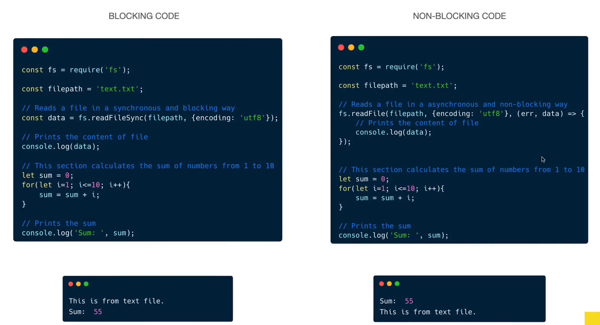

---

## ❓ How Does JavaScript Handle Asynchronous Tasks?

JavaScript is a **single-threaded**, **non-blocking**, and **event-driven** language. It uses the **Call Stack**, **Web APIs**, **Queues**, and the **Event Loop** to manage asynchronous operations efficiently.

When we run JavaScript code, the engine uses:

- **Call Stack**: Executes synchronous code (doesn't wait for anything).
- **Web APIs**: Provided by the browser for timers, DOM, fetch, etc.
- **Microtask Queue (high priority)**: High priority queue for `Promise.then`, `async/await`.
- **Macrotask Queue (aka Task Queue)**: Lower priority queue for `setTimeout`, `setInterval`, I/O.
- **Event Loop**: The "gatekeeper" that manages when queues are moved to the stack.

### 1️⃣ Task Queue (Macrotask Queue)

- Holds asynchronous tasks from **Web APIs**.
- Follows **FIFO** (First In, First Out) order.
- Used for:
  - `setTimeout`
  - `setInterval`
  - `setImmediate`
  - `requestAnimationFrame`
  - I/O tasks
  - UI rendering

```js
setTimeout(() => {
  console.log("Macrotask from setTimeout");
}, 0);
```

- Macrotasks are checked after the **Call Stack** is empty.
- Macrotask Queue is processed after the **Microtask Queue** is fully drained.

### 2️⃣ Microtask Queue (aka Promise Jobs)

- Has higher priority than the Task Queue.
- Used for:
  - `Promise.then`
- `async/await`
- `queueMicrotask`
- `MutationObserver`

```js
Promise.resolve().then(() => {
  console.log("Microtask from Promise");
});
```

- Microtasks are processed immediately after the current **Call Stack** is empty.
- The **Microtask Queue** is fully drained before any Macrotask is executed.

### 3️⃣ Event Loop

- Continuously monitors the Call Stack and the Queues.
- As soon as the Call Stack is empty:
  - Executes all Microtasks from the Microtask Queue.
  - Then executes the next task from the Macrotask Queue.
- Priority:

  ```
  Call Stack → Microtask Queue → Macrotask Queue
  ```

- Responsibilities of the Event Loop: - Enables non-blocking behavior. - Handles callbacks from Web APIs. - Coordinates between queues and stack.

      ```js
      While (true) {

  if (CallStack.isEmpty()) {
  runAllMicrotasks();
  runNextMacrotask();
  }
  }

````


### 4️⃣ Call Stack

- A data structure that manages function execution.
- Based on LIFO (Last In, First Out).
- Every function call creates an Execution Context pushed onto the stack.
- Once done, it's popped off the stack.

```js
function sum() {
  let name = "Dev";

  function print() {
    console.log("Hello World");
  }

  print();
}

sum();
````

Internals:

- When the script starts, the Global Execution Context is added.
- Nested functions create new Execution Contexts pushed on top.
- When functions complete, their contexts are removed.

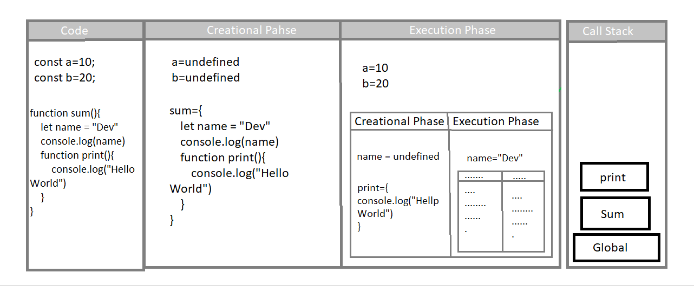

---

- **Yellow Block (Call Stack)**: Where all code execution happens and it doesn't wait for nothing (asynchronous tasks).
- **Web APIs**: External features provided by the browser (e.g., timers, fetch) to perform asynchronous tasks. These are not part of JavaScript itself.
- **Task Queue (Macrotask Queue)**: Handles tasks like `setTimeout`, `I/O`, `UI Rendering`.
- **Microtask Queue / Multitask Queue / Promise Jobs**: High-priority queue used for Promises and `async/await`. Executes before the Task Queue.

5. **Event Loop**: Monitors Task Queue and Multitask Queue, moving tasks to the Call Stack for execution when the stack is empty.

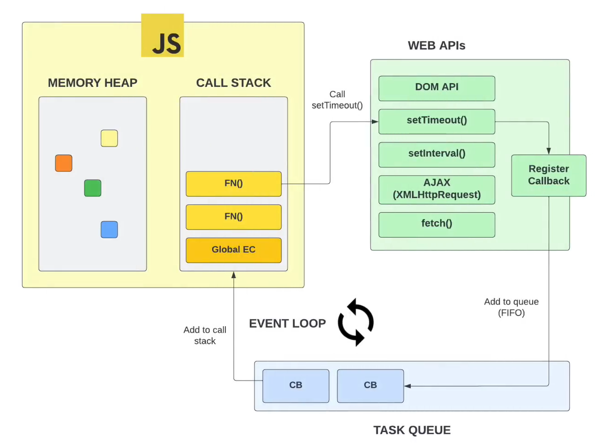
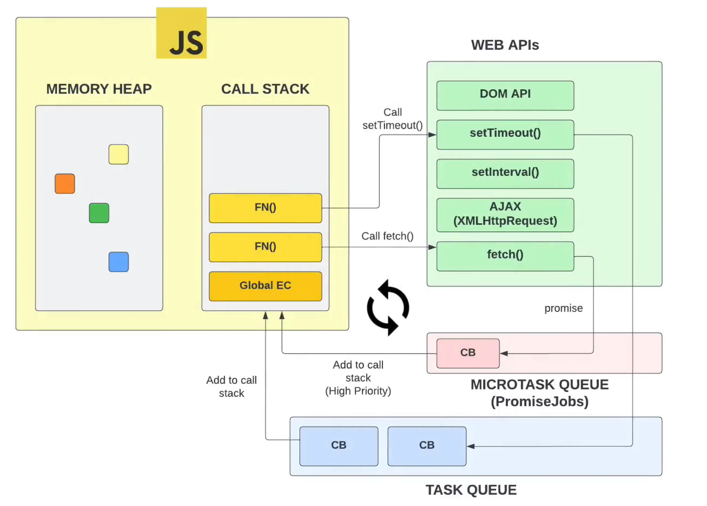

```javascript
console.log("1");
setTimeout(() => {
  console.log("2");
}, 5000);
console.log("3");
```

```
1
3
2
```

```javascript
console.log("Global 1!");
setTimeout(() => {
  console.log("Task Queue!");
}, 0);
Promise.resolve().then(() => {
  console.log("Microtask Queue!");
});
console.log("Global 2!");
```

```
Global 1!
Global 2!
Microtask Queue!
Task Queue!
```

```javascript
console.log("1");
setTimeout(() => {
  console.log("2");
}, 0);
console.log("3");
```

`Why does setting the timer to 0 still log `2` last?`

- Logs `1` to the console.
- Sets a `setTimeout` with 0ms delay, placing the callback in the Web API.
- Logs `3` as the Call Stack processes synchronous code first.
- The timer expires and places the callback (`console.log('2')`) in the Task Queue.
- The Event Loop waits for the Call Stack to be empty before moving the task from the Task Queue.
- Once the stack is empty, the callback (`console.log('2')`) is moved to the Call Stack and logged last.

---

## ❓ What is Starvation and When Does It Occur?

> ⚠️ **Starvation occurs when Microtasks keep adding more Microtasks recursively, delaying the execution of Macrotasks indefinitely.**

This can happen in JavaScript when tasks in the **Microtask Queue** keep being added at a high rate, leaving no opportunity for tasks in the **Task Queue** to run. Microtasks have higher priority, and rapid addition of microtasks leads to their starvation.

✅ Real-world Analogy
🔪 You're cooking pasta. You start boiling water (async task). While waiting, you chop vegetables (sync tasks). You're not blocked — you're multitasking. That’s async JavaScript.

```js
console.log("Global 1!");
setTimeout(() => {
  console.log("Task Queue!");
}, 0);

Promise.resolve().then(() => {
  console.log("Microtask Queue!");
  Promise.resolve().then(() => {
    console.log("Microtask Queue!");
    Promise.resolve().then(() => {
      console.log("Microtask Queue!");
      Promise.resolve().then(() => {
        console.log("Microtask Queue!");
      });
    });
  });
});

console.log("Global 2!");
```

**Execution Breakdown:**

- Logs `Global 1!`.
- `setTimeout` schedules a callback and places it in the Task Queue.
- `Promise.resolve()` adds `.then()` to the Microtask Queue.
- Logs `Global 2!`.
- The `Event Loop` starts processing the Microtask Queue:
  - Logs `Microtask Queue!` 4 times due to nested `Promise.resolve().then()`.
- After all microtasks are processed, the Task Queue runs:
  - Logs Task Queue!.

> If microtasks keep generating more microtasks recursively, tasks in the Task Queue may never get executed. This is known as starvation.
> Be careful when chaining too many microtasks, especially in performance-critical or animation-heavy environments.

---

## ❓ What is the Difference between Mutable and Immutable?

1. Mutable
   **Mutable** means data can be changed after creation. Objects, arrays, and functions are mutable by default.

- **Objects** are mutable by reference (memory address). We can also work with them immutably.

```javascript
const person = {
  name: "Ahad Ali",
  age: 18,
};
// Create a new object by copying existing one and modifying a value (Immutable style)
person = { ...person, age: 20 };
console.log(person); // { name: "Ahad Ali", age: 20 }
```

```javascript
const person = {
  firstName: "Ahad",
  lastName: "Ali",
  age: 50,
  eyeColor: "blue",
};
const x = person;
x.age = 10; // The object `x` is not a copy, it's the same reference as `person`. Any changes to `x` will also change `person`.
```

```javascript
const user = {
  name: "Ahad Ali",
  age: 20,
};
user.name = "Abdul Ahad";
console.log(user); // Modifying properties is allowed even with 'const'. 'const' only prevents reassignment of the reference, not the mutation of the object.
```

- **Arrays** are mutable, but some methods return new arrays instead of modifying the original.

**Mutable methods** like `push`, `sort`, and `splice` directly modify the original array.

```javascript
let mutableArray = [1, 2, 3];
mutableArray.push(4); // This will modify the array directly
console.log(mutableArray); // Output: [1, 2, 3, 4]
```

**Immutable methods** like `map`, `filter`, and `slice` create a new array, leaving the original unchanged.

```javascript
let originalArray = [1, 2, 3, 4, 5];
let newArray = originalArray.map((item) => item * 2); // // map method creates a new array without modifying the original array
console.log(originalArray); // Output: [1, 2, 3, 4, 5]
console.log(newArray); // Output: [2, 4, 6, 8, 10]

let filteredArray = originalArray.filter((item) => item > 2); // // filter method creates a new array without modifying the original array
console.log(filteredArray); // Output: [3, 4, 5]

let slicedArray = originalArray.slice(1, 4); // // slice method creates a shallow copy of the original array
console.log(slicedArray); // Output: [2, 3, 4]
```

2. Immutable
   **Immutability** means once data is created, it cannot be changed. Instead of modifying it, a new one is created.

- **Primitive types** (numbers, strings, booleans) are immutable.
- **Strings** are immutable. Any operation on a string creates a new one, leaving the original unchanged.

```javascript
let immutable = "Hello";
immutable[1] = "a"; // This will not work, because strings are immutable
immutable = immutable + " World"; // This creates a new string, not modifying the original
console.log(immutable); // Output: "Hello World"
```

```javascript
// Immutable Values (Numbers and Strings)
let myNum = 27;
let myString = "hi how are you";
let myNum2 = myNum;
let myString2 = myString;
myNum2 = myNum2 - 5;
myString2 = myString2 += " doing";

console.log(myNum); // Output: 27 (unchanged)
console.log(myNum2); // Output: 22 (new value)
console.log(myString); // Output: "hi how are you" (unchanged)
console.log(myString2); // Output: "hi how are you doing" (new value)
```

| **Aspect**        | **Mutable**                                                 | **Immutable**                                               |
| ----------------- | ----------------------------------------------------------- | ----------------------------------------------------------- |
| **Advantages**    | - Easier to modify existing code.                           | - Helps with easy debugging.                                |
|                   | - More memory efficient.                                    | - Ensures no state corruption and maintains data integrity. |
| **Disadvantages** | - Can lead to bugs if not used correctly.                   | - More memory intensive due to new copies being created.    |
|                   | - Debugging can be difficult due to potential side effects. | - Can result in worse performance in memory-heavy tasks.    |

---

## ❓ What is a Promise in JavaScript?

> A **Promise** in JavaScript is an object that represents the eventual **completion** or **failure** of an asynchronous operation.
> `OR`
> A **Promise** is an object that may produce a single value some time in the future: either a resolved value, or a reason that it’s not resolved (e.g., a network error occurred).

Just like real-life promises:

> "I'll deliver your package tomorrow."
>
> - If delivered: ✅ Fulfilled
> - If not: ❌ Rejected

### A Promise has 3 states:

- `pending`: Initial state
- `fulfilled`: Operation completed successfully
- `rejected`: Operation failed

We use `.then()` to handle success and `.catch()` to handle errors.

### Basic setTimeout Example

```js
console.log(1);
setTimeout(() => {
  console.log(3); // runs later
}, 1000);
console.log(2);
```

Output:

```
1
2
3
```

### Problem: Getting a value after async finishes

You can't do this:

```js
let result = setTimeout(() => 5, 1000); // ❌ result will be undefined
```

- You need **Callbacks, Promises, or Async/Await**.

### Callbacks

```js
function sum(a, b) {
  return a + b;
}

let asyncFx = (a, b, cb) => {
  setTimeout(() => {
    cb(sum(a, b)); // pass result to callback
  }, 1000);
};

asyncFx(2, 3, function (result) {
  console.log("Result:", result);
});
```

### ⚠️ Callback Hell (Nested Callbacks)

```js
asyncFx(1, 2, function (res1) {
  asyncFx(3, res1, function (res2) {
    asyncFx(4, res2, function (res3) {
      console.log(res3); // deeply nested
    });
  });
});
```

> This is called **Callback Hell** 😩 — hard to read, debug, and maintain.

### ❗ What is Callback Hell?

Callback Hell refers to the situation where callbacks are nested within callbacks multiple levels deep, making the code:

- 😵‍💫 Hard to read
- 🐞 Difficult to debug
- 😫 Painful to maintain

This happens when asynchronous functions are dependent on the result of previous async operations, leading to a pyramid or staircase structure of code.

**Real-life Analogy:**

- Imagine calling someone, who calls someone else, who then calls someone else to get your work done. If anyone forgets or makes a mistake, the whole process breaks — and it’s hard to trace where.

**Drawbacks of Callback Hell:**

- Tight coupling between async operations
- Increases complexity and cognitive load
- Makes error handling inconsistent
- Violates the Single Responsibility Principle

✅ Solution: Use Promises or async/await to flatten the code and improve readability.

### Solution: Promises

A **Promise** is an object that represents the eventual completion (or failure) of an asynchronous operation.

```js
let asyncFx = (a, b) =>
  new Promise((resolve, reject) => {
    setTimeout(() => {
      if (a > 0 && b > 0) {
        resolve(a + b); // ✅ success
      } else {
        reject("Invalid inputs"); // ❌ error
      }
    }, 1000);
  });
```

### ✅ Promise Usage

```js
asyncFx(2, 3)
  .then((res) => console.log(res))
  .catch((err) => console.error(err));
```

### Promise Chain

```js
asyncFx(1, 2)
  .then((res1) => asyncFx(res1, 3))
  .then((res2) => asyncFx(res2, 4))
  .then((res3) => console.log("Final:", res3))
  .catch((err) => console.error(err));
```

### ⛓️ Promise APIs (Parallel Execution)

#### Promise.all

- Waits for all to succeed:

```js
Promise.all([asyncFx(1, 1), asyncFx(2, 2), asyncFx(3, 3)]).then((results) =>
  console.log(results)
);
```

### Promise.allSettled

Returns result of all (success or failure):

```js
Promise.allSettled([asyncFx(1, 1), asyncFx(-1, 2)]).then(console.log);
```

### Promise.race

Resolves/rejects as soon as one finishes:

```js
Promise.race([asyncFx(1, 1), asyncFx(5, 5)]).then(console.log);
```

### Async/Await

Cleaner syntax for promises.

```js
async function init() {
  try {
    let res1 = await asyncFx(1, 2);
    let res2 = await asyncFx(res1, 3);
    console.log({ res2 });
  } catch (err) {
    console.log("Error:", err);
  }
}
init();
```

### 🔒 Bonus: Real-life API (Paginated Data)

```js
async function* fetchPages() {
  for (let i = 1; i <= 3; i++) {
    const res = await fetch(`https://api.example.com/data?page=${i}`);
    const data = await res.json();
    yield* data.items;
  }
}

(async () => {
  for await (let item of fetchPages()) {
    console.log(item);
  }
})();
```

| Concept            | Key Point                           |
| ------------------ | ----------------------------------- |
| setTimeout         | Browser API for delaying code       |
| Callback           | Function passed to be called later  |
| Callback Hell      | Nested callbacks – hard to manage   |
| Promise            | Cleaner way to manage async results |
| .then() / .catch() | Chaining success/error handlers     |
| async/await        | Syntactic sugar for promises        |
| Promise.all()      | Run async in parallel               |
| Async Iterator     | Loop over async data                |


---

## ❓ What is Async/Await in JavaScript?

`async/await` is modern syntax built on top of **Promises** for handling asynchronous operations...

It allows developers to write asynchronous code that looks and behaves like synchronous code — making it easier to read, write, and debug.

### How it Works

- `async` keyword declares an **asynchronous function** that always returns a Promise.
- `await` pauses the execution **inside an async function** until the Promise is settled (resolved or rejected).

```js
function fetchData() {
  return new Promise((resolve, reject) => {
    setTimeout(() => {
      const data = "Hello World";
      resolve(data);
    }, 2000);
  });
}

async function displayData() {
  const data = await fetchData(); // waits for fetchData to complete
  console.log(data); // prints: Hello World (after 2 seconds)
}

displayData();
```

> ❗️ You can only use `await` inside a function marked as `async`.

---

## ❓ What is the Nature of Promises and Async/Await in JavaScript?

### Nature of `resolve()` and `.then()` in JavaScript

#### 1. `resolve()` is **synchronous**

- It **immediately** changes the state of the Promise to _fulfilled_.
- Does **not wait** for anything—runs as soon as it's called.

#### 2. `.then()` and `.catch()` are **asynchronous**

- These callbacks are placed in the **Microtask Queue**.
- Even if the Promise is already resolved, the `.then()` callback will **not** run immediately.
- Executes **after** the current call stack is cleared.

### Immediate `resolve()`

```javascript
const promise = new Promise((resolve, reject) => {
  console.log("Executor starts");
  resolve("Resolved value"); // Changes promise state immediately
  console.log("Executor ends");
});

promise.then((value) => {
  console.log("Then:", value); // Executes later via Microtask Queue
});

console.log("After promise creation");
```

**Output:**

```
Executor starts
Executor ends
After promise creation
Then: Resolved value
```

**Why?**

> `.then()` callback goes to the Microtask Queue and waits until the call stack is empty.

### Asynchronous resolve()

```js
const promise = new Promise((resolve, reject) => {
  console.log("Executor starts");
  setTimeout(() => {
    resolve("Resolved after 1 second");
  }, 1000);
  console.log("Executor ends");
});

promise.then((value) => {
  console.log("Then:", value);
});

console.log("After promise creation");
```

**Output:**

```
Executor starts
Executor ends
After promise creation
Then: Resolved after 1 second
```

### Nature of async, await, and Microtask Queue

How `await` Works:

- It pauses the `async` function at that line.
- The continuation after `await` is put in the Microtask Queue.
- Ensures all current synchronous code completes first.

### `await` and Execution Order

```js
async function example() {
  console.log("Start");
  await Promise.resolve(); // Pauses here
  console.log("End"); // Resumes from Microtask Queue
}

console.log("Before calling example");
example();
console.log("After calling example");
```

**Output:**

```js
Before calling example
Start
After calling example
End
```

**Why?**

- `await` doesn't block the main thread—it defers the rest of the async function to run after synchronous code finishes.

---

## ❓ When to Use Promise `.then()` / `.catch()` vs `async/await` vs `try/catch`?

- Use `.then()` / `.catch()` for promise chaining.
- Use `async/await` for cleaner syntax in async flows.
- Use `try/catch` with `async/await` for error handling.

```js
// Using then/catch
fetch("/api")
  .then((res) => res.json())
  .then((data) => console.log(data))
  .catch((err) => console.error(err));

// Using async/await + try/catch
async function fetchData() {
  try {
    const res = await fetch("/api");
    const data = await res.json();
    console.log(data);
  } catch (error) {
    console.error(error);
  }
}
```

---

## ❕ Bonus Questions

### Promise Function Execution Flow

```js
console.log("start");
const fn = () =>
  new Promise((resolve, reject) => {
    console.log(1);
    resolve("success");
  });

console.log("middle");
fn().then((res) => {
  console.log(res);
});
console.log("end");
```

✅ **Output**:

```
start
middle
1
end
success
```

✅ **Explanation**: `new Promise` executes synchronously. `.then` runs after current call stack.

### Promise Chaining with Catch

```js
function job() {
  return new Promise((resolve, reject) => {
    reject();
  });
}

let promise = job();
promise
  .then(() => console.log("Success 1"))
  .then(() => console.log("Success 2"))
  .then(() => console.log("Success 3"))
  .catch(() => console.log("Error 1"))
  .then(() => console.log("Continue after catch"));
```

✅ **Output**:

```
Error 1
Continue after catch
```

✅ **Explanation**: Once error is caught, subsequent `.then` continues the chain.

### Conditional Rejection and Recovery

```js
function job(state) {
  return new Promise((resolve, reject) => {
    if (state) {
      resolve("success");
    } else {
      reject("error");
    }
  });
}

job(true)
  .then((data) => {
    console.log(data);
    return job(false);
  })
  .catch((err) => {
    console.log(err);
    return "Error caught";
  })
  .then((data) => {
    console.log(data);
    return job(true);
  })
  .catch((err) => {
    console.log(err);
  });
```

✅ **Output**:

```
success
error
Error caught
```

✅ **Explanation**: Errors are caught and recovered. Final catch won't run if all promises succeed.

### Throw inside Promise Chain

```js
job(true)
  .then((data) => {
    console.log(data); // success
    return job(true);
  })
  .then((data) => {
    if (data !== "victory") {
      throw "Defeat";
    }
    return job(true);
  })
  .then((data) => {
    console.log(data);
  })
  .catch((error) => {
    console.log(error);
  });
```

✅ **Output**:

```
success
success
Defeat
```

✅ **Explanation**: Custom errors thrown in `.then()` go to `.catch()`.

### Recursive Promise Execution

```js
function importantAction(user) {
  return new Promise((resolve) => {
    setTimeout(() => resolve(`Important action for ${user}`), 1000);
  });
}
function likeTheVideo(video) {
  return new Promise((resolve) => {
    setTimeout(() => resolve(`Liked the video: ${video}`), 1000);
  });
}
function shareTheVideo(video) {
  return new Promise((resolve) => {
    setTimeout(() => resolve(`Shared the video: ${video}`), 1000);
  });
}

function promRecurse(funcPromises) {
  if (funcPromises.length === 0) return;
  const currPromise = funcPromises.shift();
  currPromise
    .then((res) => {
      console.log(res);
      promRecurse(funcPromises);
    })
    .catch((err) => console.error(err));
}

promRecurse([
  importantAction("Ahad Ali"),
  likeTheVideo("Javascript Interview Questions"),
  shareTheVideo("Javascript Interview Questions"),
]);
```

✅ **Output**:

```
Important action for Ahad Ali
Liked the video: Javascript Interview Questions
Shared the video: Javascript Interview Questions
```

✅ **Explanation**: Recursive function executes promises one by one in order.

### Callback Hell → Promises

```js
// Callback Hell Example
function step1(cb) {
  setTimeout(() => {
    console.log("Step 1");
    cb();
  }, 1000);
}
function step2(cb) {
  setTimeout(() => {
    console.log("Step 2");
    cb();
  }, 1000);
}
function step3(cb) {
  setTimeout(() => {
    console.log("Step 3");
    cb();
  }, 1000);
}

step1(() => {
  step2(() => {
    step3(() => {
      console.log("Done");
    });
  });
});
```

✅ **Problem**: Hard to read and maintain - **Callback Hell**.

➡️ **Convert to Promises:**

```js
function step1() {
  return new Promise((res) => {
    setTimeout(() => {
      console.log("Step 1");
      res();
    }, 1000);
  });
}
function step2() {
  return new Promise((res) => {
    setTimeout(() => {
      console.log("Step 2");
      res();
    }, 1000);
  });
}
function step3() {
  return new Promise((res) => {
    setTimeout(() => {
      console.log("Step 3");
      res();
    }, 1000);
  });
}

step1()
  .then(() => step2())
  .then(() => step3())
  .then(() => console.log("Done"));
```

✅ **Result**: Flat, readable, and maintainable promise chain.

### Async/Await Version of the Above

```js
async function runSteps() {
  await step1();
  await step2();
  await step3();
  console.log("Done");
}

runSteps();
```

✅ **Explanation**: Even more readable with `async/await`. Each step runs sequentially like synchronous code.

### Error Handling with Try/Catch in Async

```js
async function runStepsSafely() {
  try {
    await step1();
    await step2();
    await step3();
    console.log("Done");
  } catch (err) {
    console.error("Something went wrong:", err);
  }
}

runStepsSafely();
```

✅ **Best Practice**: Always wrap async logic with try/catch to handle rejections properly.

### ⚠️ Common Trap: Mixing Async/Await and Then

```js
async function test() {
  return "Hello";
}

// This works but is less readable
const result = test().then((res) => console.log(res)); // Hello

// Better approach
async function betterTest() {
  const res = await test();
  console.log(res);
}
betterTest();
```

❌ Mixing `.then()` with `await` often leads to confusion. Stick with one style.

## ❓ What is Event Propagation?

**Event Propagation** is the mechanism that defines how events travel through the DOM (Document Object Model) when an event is fired. It consists of **three phases**:

1. **Capturing Phase** (Trickle-down): The event travels from the document root to the target element.
2. **Target Phase**: The event reaches the actual target element where the interaction occurred.
3. **Bubbling Phase** (Bubble-up): The event then bubbles back up from the target element to the document root.

```plaintext
document → html → body → parent → target  (Capturing)
                    target                (Target Phase)
target → parent → body → html → document  (Bubbling)
```

✅ **Why It's Important:**
Understanding propagation helps you:

- Decide where to place event listeners
- Prevent unwanted behavior by stopping propagation
- Delegate events efficiently

---

## ❓ What actually do Events do and why stop or not stop them?

### ✅ What Do Events Do?

In JavaScript, **events** allow interaction with the DOM when users perform actions such as:

- Clicking a button
- Typing into an input
- Hovering over an element

Events trigger **handlers (callbacks)** that run code in response to those interactions.

#### Example: Button Click

```html
<button id="btn">Click Me</button>
```

```js
document.getElementById("btn").addEventListener("click", () => {
  console.log("Button clicked!");
});
```

### ✅ Why Stop Events?

Stopping an event is useful when:

- You want to **prevent it from reaching parent elements** (stopPropagation)
- You want to **prevent other listeners on the same element** (stopImmediatePropagation)
- You want to **block the default browser behavior** (preventDefault)

#### Example: Prevent Event Bubbling

```js
const outer = document.querySelector(".outer");
const inner = document.querySelector(".inner");

outer.addEventListener("click", () => console.log("Outer clicked"));
inner.addEventListener("click", (e) => {
  e.stopPropagation();
  console.log("Inner clicked");
});
```

✅ Clicking `.inner` will not trigger `.outer`'s handler.

#### Example: Prevent Default Behavior

```js
document.querySelector("form").addEventListener("submit", (e) => {
  e.preventDefault();
  console.log("Form submission prevented");
});
```

✅ Prevents form from actually submitting or reloading the page.

### ❌ When **Not** to Stop Events?

Avoid stopping events when:

- You want **default behavior**, like links navigating
- You're relying on **bubbling** for delegation
- Other handlers might be important (e.g. analytics tracking)

✅ **Best Practice:** Only stop an event if absolutely necessary. Overuse can break natural UI behavior and debugging.

## ❓ What is Event Bubbling? (with Example)

**Event Bubbling** is when an event starts at the **target element** and **bubbles up** through its ancestors in the DOM.

```html
<div onclick="alert('Div')">
  <form onclick="alert('Form')">
    <button onclick="alert('Button')">Click Me</button>
  </form>
</div>
```

✅ **What Happens When You Click the Button?**

- The button's `onclick` runs first
- Then the form's `onclick`
- Finally the div's `onclick`

🧠 **Output Order:**

```
Button → Form → Div
```

✅ **Use Case:** Most common phase for attaching handlers (default in `addEventListener`).

---

## ❓ What is Event Capturing?

**Event Capturing** is the opposite of bubbling — the event travels from the **document down to the target**.

To enable capturing, set the `capture: true` flag:

```js
const form = document.querySelector("form");

form.addEventListener(
  "click",
  function () {
    alert("Form clicked during capturing");
  },
  { capture: true }
);
```

🧠 **How It Works:**

- Listener triggers **before** bubbling phase begins

✅ **Use Case:** Useful when you want to catch events early, especially on parent/ancestor nodes.

---

## ❓ How to Stop Bubbling and Capturing?

To stop the event from continuing to propagate through the DOM:

```js
const button = document.querySelector("button");

button.addEventListener("click", function (event) {
  event.stopPropagation();
  alert("Button clicked and propagation stopped");
});
```

✅ **Explanation:**

- `stopPropagation()` halts the event from moving further in **either direction** (bubbling or capturing)

🧠 Also consider:

- `stopImmediatePropagation()` if multiple listeners exist on the same element

---

## ❓ What is the Difference between `event.target` vs `this` vs `event.currentTarget`?

```js
const div = document.querySelector(".wrapper");

div.addEventListener("click", function (event) {
  console.log("event.target:", event.target); // Actual element clicked
  console.log("this:", this); // Element with handler
  console.log("event.currentTarget:", event.currentTarget); // Same as 'this'
});
```

✅ **Key Differences:**

- `event.target`: The actual element that was clicked
- `this` / `event.currentTarget`: The element on which the event listener is attached

🧠 **Tip:** Use `currentTarget` for delegation; avoid assumptions from `target`

---

## ❓ What is Event Delegation?

**Event Delegation** is a pattern where a **single event listener** on a parent element handles events from multiple child elements.

```js
document.querySelector(".modalContainer").addEventListener("click", (e) => {
  if (e.target.classList.contains("modal")) {
    toggleModal(false);
  }
});
```

✅ **Why It's Powerful:**

- You don't need to attach listeners to every child
- Great for dynamically added elements

🧠 **Real Example:** Handling clicks on a dynamic list:

```js
ul.addEventListener("click", function (e) {
  if (e.target.tagName === "LI") {
    alert("Clicked item: " + e.target.textContent);
  }
});
```

### Event Propagation Flow (Summary)

```plaintext
// Event Phases (Clicking on a button inside a div)

Capturing Phase: document → html → body → div → button
Target Phase:    button (event occurs here)
Bubbling Phase:  button → div → body → html → document
```

🧠 By default, `addEventListener` uses **bubbling** phase unless `{ capture: true }` is specified.

---

## ❓ Do All Events Bubble?

❌ **No.** Some events do not bubble by default:

- `focus`
- `blur`
- `load`
- `mouseenter` / `mouseleave`

✅ **Workaround:**
Use their bubbling counterparts:

- `focusin` instead of `focus`
- `focusout` instead of `blur`
- Custom bubbling events with `dispatchEvent`

---

## ❓ What is the Difference Between `stopPropagation()` and `stopImmediatePropagation()`?

```js
const btn = document.querySelector("button");

btn.addEventListener("click", (e) => {
  e.stopImmediatePropagation();
  console.log("Listener 1");
});

btn.addEventListener("click", () => {
  console.log("Listener 2"); // ❌ Won’t execute
});
```

✅ **Comparison:**

- `stopPropagation()`: Stops propagation to ancestor elements only
- `stopImmediatePropagation()`: Also prevents other listeners on **same element** from running

🧠 Use it cautiously when you need strict control of handler execution order.

---

## ❓ What Are passive, once, and capture Options in addEventListener?

```js
const element = document.querySelector("#scrollable");

element.addEventListener(
  "scroll",
  (e) => {
    console.log("Scrolled!");
  },
  {
    passive: true, // Don't block UI thread (good for scroll/touch)
    once: true, // Run only once then auto-remove
    capture: false, // Run in bubbling phase (default)
  }
);
```

✅ **Breakdown:**

- `passive`: Improves performance, especially for scroll/touch
- `once`: Perfect for setup/one-time actions (e.g., welcome popup)
- `capture`: Flip between bubbling and capturing

🧠 Always match these flags to performance and phase needs in production apps.

---

## ❕ Bonus Question

How to Create a Modal That Closes on Outside Click?

#### ✅ HTML

```html
<div class="modalContainer">
  <div class="modal">
    <p>This is the modal content</p>
  </div>
</div>
<button class="modalButton">Open Modal</button>
```

#### ✅ CSS

```css
.modalContainer {
  display: none;
  position: fixed;
  top: 0;
  left: 0;
  width: 100%;
  height: 100%;
  justify-content: center;
  align-items: center;
  background: rgba(0, 0, 0, 0.5);
}
.modal {
  background: white;
  padding: 2rem;
  border-radius: 8px;
}
```

#### ✅ JavaScript

```js
const container = document.querySelector(".modalContainer");
const button = document.querySelector(".modalButton");

button.addEventListener("click", () => toggleModal(true));

function toggleModal(show) {
  container.style.display = show ? "flex" : "none";
}

container.addEventListener("click", (e) => {
  if (e.target.classList.contains("modalContainer")) toggleModal(false);
});
```

🧠 **Delegation Used:** The modal listens to its own container to detect outside clicks.

---

## ❓ What Are the Major ECMAScript Updates? (ES4, ES5, ES6, etc.)

ECMAScript is the standard specification on which JavaScript is based.

| Version | Year  | Highlights                                   |
| ------- | ----- | -------------------------------------------- |
| ES3     | 1999  | First widely adopted version                 |
| ❌ ES4  | -     | Abandoned due to complexity                  |
| ES5     | 2009  | `strict mode`, JSON support, getters/setters |
| ES6     | 2015  | Major update (let, const, arrow fn, classes) |
| ES7+    | 2016+ | Yearly updates: async/await, includes, etc.  |

---

## ❓ What Are the Key Features Introduced in ES6 (ECMAScript 2015)?

**ES6 (also called ES2015)** was a **major update** to JavaScript that made the language more powerful, readable, and suitable for large-scale applications.

### 1. Block-scoped Variables

- `let` and `const` replaced `var` for safer scoping.

```js
let x = 5;
const y = 10;
```

- `let:` Mutable, block-scoped.
- `const:` Immutable (constant reference), block-scoped.

### 2. Arrow Functions

- Shorter syntax and lexical this binding:

```js
const add = (a, b) => a + b;
```

### 3. Default Parameters

- Set default values directly in function parameters.

```js
function greet(name = "Guest") {
  console.log("Hello", name);
}
```

### 4. Template Literals

- Use backticks ` ` for multi-line strings and embedded expressions:

```js
let name = "Ahad Ali";
console.log(`Welcome, ${name}!`);
```

### 5. Destructuring

- Extract values from arrays or objects easily:

```js
let [a, b] = [1, 2];
let { name, age } = { name: "Ahad Ali", age: 20 };
```

### 6. Enhanced Object Literals

- Simplify object creation:

```js
let x = 10;
let obj = {
  x,
  greet() {
    return "Hello";
  },
};
```

### 7. Classes and Inheritance

- ES6 introduces class-based OOP:

```js
class Person {
  constructor(name) {
    this.name = name;
  }
  greet() {
    console.log(`Hi, I’m ${this.name}`);
  }
}

class Student extends Person {
  constructor(name, course) {
    super(name);
    this.course = course;
  }
}
```

### 8. Promises

- Native support for asynchronous handling:

```js
let promise = new Promise((resolve, reject) => {
  setTimeout(() => resolve("Done!"), 1000);
});

promise.then((res) => console.log(res));
```

### 9. Modules (import/export)

- Built-in module system:

```js
// utils.js
export const sum = (a, b) => a + b;

// app.js
import { sum } from "./utils.js";
```

### 10. Spread and Rest Operators (...)

- `Spread:` Expands elements.
- `Rest:` Gathers elements.

```js
// Spread
let nums = [1, 2, 3];
let more = [...nums, 4, 5];

// Rest
function sum(...args) {
  return args.reduce((a, b) => a + b, 0);
}
```

### 11. for...of Loop

- Loop over iterables:

  ```js
  let arr = [10, 20, 30];
  for (let num of arr) {
    console.log(num);
  }
  ```

### 12. New Data Structures: Map & Set

```js
let map = new Map();
map.set("a", 1);

let set = new Set([1, 2, 3]);
```

- `Map:` Key-value pairs.
- `Set:` Unique values only.

### 13. Symbol Data Type

- Creates unique identifiers:

```js
let id = Symbol("id");
```

### 14. Iterators and Generators

- **Iterator:** Object with a .next() method.
- **Generator:** Special function that can pause/resume.

```js
function* gen() {
  yield 1;
  yield 2;
  yield 3;
}
```

## ❓ What is the Difference Between `window` and `document` in JavaScript?

Both `window` and `document` are part of the **Browser Object Model (BOM)** and **DOM (Document Object Model)** respectively, but they serve different purposes.

| Feature                    | `window`                                                 | `document`                                                        |
| -------------------------- | -------------------------------------------------------- | ----------------------------------------------------------------- |
| **Definition**             | Represents the **browser window** or tab                 | Represents the **HTML document** loaded in the window             |
| **Hierarchy**              | Root-level object                                        | Child of the `window` object                                      |
| **Implicit Availability**  | Available globally (you don’t need to write `window.`)   | Accessed using `window.document` or directly as `document`        |
| **Examples of Methods**    | `alert()`, `confirm()`, `setTimeout()`                   | `getElementById()`, `querySelector()`, `getElementsByClassName()` |
| **Examples of Properties** | `window.location`, `window.history`, `window.innerWidth` | `document.body`, `document.title`, `document.forms`               |

### Real-Life Analogy:

- **`window`** is like your **browser tab**.
- **`document`** is the **page (HTML)** that lives inside that tab.

```js
// window methods and properties
alert("Hello!"); // same as window.alert("Hello!");
console.log(window.innerWidth); // width of the browser window

// document methods and properties
console.log(document.title); // prints title of the page
const heading = document.getElementById("main-heading");
```

---

## ❓ What is the Difference Between DOM and BOM in JavaScript?

| Feature     | DOM (Document Object Model)                       | BOM (Browser Object Model)                        |
| ----------- | ------------------------------------------------- | ------------------------------------------------- |
| Purpose     | Represents the structure of the **HTML document** | Represents browser components outside the DOM     |
| Objects     | `document`, `getElementById()`, etc.              | `window`, `navigator`, `location`, `screen`, etc. |
| Usage       | Used to **manipulate web page content**           | Used to **interact with the browser window**      |
| Scope       | Part of the webpage                               | Part of the browser environment                   |
| Provided By | W3C                                               | Browser vendors                                   |

**DOM**: Controls and updates HTML & CSS.

**BOM**: Controls browser-specific features like popups, URL navigation, and window size.

---

## ❓ What is the Difference between Local Storage vs Session Storage vs Cookies in JavaScript?

All three are client-side storage mechanisms used to **store data in the browser**, but they differ in:

- **Lifetime** (how long data persists)
- **Scope** (tab vs window vs server)
- **Size limits**
- **Use cases** (frontend state vs authentication/session)

Understanding these differences is important in interviews when discussing **state management**, **authentication**, or **client-server communication**.

### Quick Overview

- `localStorage`: Stores persistent data on the browser (doesn’t expire).
- `sessionStorage`: Stores temporary data that is cleared once the tab/window is closed.
- `cookies`: Can be accessed both by client and server. Sent with every HTTP request.

| Feature             | `localStorage`                                   | `sessionStorage`                       | `cookies`                                      |
| ------------------- | ------------------------------------------------ | -------------------------------------- | ---------------------------------------------- |
| **Lifetime**        | Until explicitly cleared (persists after reload) | Only while the tab/window is open      | Can expire (set via expiry) or session-only    |
| **Scope**           | Across tabs/windows of same origin               | Same tab/window only                   | Across tabs/windows (and sent with requests)   |
| **Storage Limit**   | ~5MB                                             | ~5MB                                   | ~4KB per cookie (limited number per domain)    |
| **Data Type**       | String only                                      | String only                            | String only                                    |
| **Accessible By**   | `window.localStorage`                            | `window.sessionStorage`                | `document.cookie`, also accessible by server   |
| **Sent to Server**  | ❌ No                                            | ❌ No                                  | ✅ Yes, sent with every HTTP request           |
| **Common Use Case** | User prefs, dark mode, auth tokens (client-side) | Unsaved form inputs, filters (per tab) | Auth/session tokens, tracking, CSRF prevention |

### ✅ localStorage

```js
// ✅ Store string
localStorage.setItem("username", "ahadalireach");

// ✅ Retrieve value
const name = localStorage.getItem("username");
console.log(name); // "ahadalireach"

// ✅ Remove specific item
localStorage.removeItem("username");

// ✅ Clear everything
localStorage.clear();
```

### ✅ sessionStorage

```js
// ✅ Store session-specific data
sessionStorage.setItem("sessionUser", "Ahad Ali");

// ✅ Retrieve it
const user = sessionStorage.getItem("sessionUser");
console.log(user); // "Ahad Ali"

// ✅ Remove specific item
sessionStorage.removeItem("sessionUser");

// ✅ Clear everything
sessionStorage.clear();
```

### ✅ Cookies

```js
// ✅ Set cookie (expires in 1 day)
document.cookie =
  "token=abc123; expires=" + new Date(Date.now() + 86400000).toUTCString();

// ✅ Read cookie
console.log(document.cookie); // All cookies for current domain

// ✅ Update cookie (same name replaces old one)
document.cookie = "token=newToken123; path=/";
```

### Storing Objects in localStorage/sessionStorage

```js
const userObj = { name: "Ahad Ali", role: "Admin" };

// ✅ Convert object to string before storing
localStorage.setItem("user", JSON.stringify(userObj));

// ✅ Retrieve and parse back
const parsedUser = JSON.parse(localStorage.getItem("user"));
console.log(parsedUser.name); // "Ahad Ali"
```

> ⚠️ Note: Cookies do not support objects or `JSON.stringify()` natively. Must be stringified manually and parsed if needed.

### Insight: When to Use What?

| Scenario                          | Best Option      | Why?                                                        |
| --------------------------------- | ---------------- | ----------------------------------------------------------- |
| Persist user theme across reload  | `localStorage`   | Long-term preference storage (even after browser restarts)  |
| Temporary cart state (single tab) | `sessionStorage` | Cleared when tab closes, useful for isolated session states |
| Auth token shared across server   | `cookie`         | Automatically sent with requests, configurable via flags    |

### Security Considerations

- ❌ Do not store sensitive info (like passwords) in any of these without encryption.
- ✅ Use `HttpOnly` and `Secure` flags with cookies for auth tokens.
- ❌ Avoid storing JWTs in localStorage if XSS is a risk. Prefer cookies with proper flags.

- Use **localStorage** for persistent, client-only data (preferences, cache).
- Use **sessionStorage** for temporary UI states (per tab).
- Use **cookies** when server-side needs access to the data (auth/session).

> 💡 Use a combination smartly depending on performance, access, and security requirements.

---

## ❓ What is the `SameSite` attribute in cookies?

**SameSite** is a cookie flag that controls **when cookies are sent** with cross-site requests.

It helps **prevent CSRF (Cross-Site Request Forgery)** attacks by limiting when cookies are included.

### 🔐 Values:
- **Strict**: Cookies are sent **only for same-site** requests.  
  → Very secure, but can break UX (e.g., logging in from another domain).
  
- **Lax**: Cookies are sent for **same-site** and **some cross-site GET** requests.  
  → Balanced between usability and security.
  
- **None**: Cookies are sent with **all cross-site** requests,  
  but **must be Secure** (sent only over HTTPS).  
  → Used when third-party cookies are needed.


---

## ❓ What Is Bundling?

**Bundling** is the process of combining multiple JavaScript (and other) files into a **single file** (or few files).

### Why?

- Reduces number of HTTP requests
- Improves performance
- Simplifies dependency management

### Tools:

- Webpack, Vite, Parcel, Rollup

---

## ❓ What Is Chunking?

**Chunking** is the process of breaking bundled code into smaller **chunks** that can be loaded **on-demand**.

### Benefits:

- Faster initial page load
- Loads only what’s needed

### Example:

In Webpack:

```js
import("./Dashboard").then(loadDashboard);
```

---

## ❓ What is the Difference between Params (Parameters) and Arguments?

### Parameters

- These are **placeholders/variables** defined in the **function definition**.
- They represent the inputs that the function expects.

```js
function add(a, b) {
  // 'a' and 'b' are parameters
  return a + b;
}
```

### Arguments

- These are the actual values passed to the function when it's called.
- They fill in the parameters.

```js
console.log(add(5, 3));
// 5 and 3 are arguments passed into the function
```

> Tip: Parameters = Expectation, Arguments = Reality 😄

---

## ❓ What is AJAX in JavaScript?

**AJAX** stands for **Asynchronous JavaScript and XML**.

It’s a technique used to **send/receive data from a server** **without reloading** the entire page.

#### ✅ Why Use AJAX?

- ✅ Improves user experience (no page reloads)
- ✅ Enables **real-time updates**
- ✅ Common in chat apps, search suggestions, infinite scroll, etc.

- You can fetch data **asynchronously** using `XMLHttpRequest` or `fetch()` (modern).
- AJAX works behind the scenes to update just part of a web page.

#### XMLHttpRequest Lifecycle (States)

| `readyState` | Meaning                    |
| ------------ | -------------------------- |
| `0`          | Request not initialized    |
| `1`          | Connection established     |
| `2`          | Request received           |
| `3`          | Processing request         |
| `4`          | Request finished and ready |

#### Making an AJAX Request (Step by Step)

```js
// ✅ Step 1: Create an instance of XMLHttpRequest
let xhr = new XMLHttpRequest();

// ✅ Step 2: Open the request (type, URL, async=true)
xhr.open("GET", "https://jsonplaceholder.typicode.com/posts", true);

// ✅ Step 3: Define the callback function to handle the response
xhr.onreadystatechange = function () {
  // Check if request is done and response is OK
  if (xhr.readyState === 4 && xhr.status === 200) {
    let data = JSON.parse(xhr.responseText);
    console.log(data); // ✅ Print API response data
  }
};

// ✅ Step 4: Send the request
xhr.send();
```

#### ✅ Output:

```js
[
  { userId: 1, id: 1, title: "...", body: "..." },
  { userId: 1, id: 2, title: "...", body: "..." },
  ...
]
```

#### AJAX vs `fetch()` (Modern)

| Feature       | XMLHttpRequest        | fetch()                     |
| ------------- | --------------------- | --------------------------- |
| Syntax        | Older & verbose       | Modern & cleaner            |
| Return Type   | Callback-based        | Promise-based               |
| JSON Handling | Manual `JSON.parse()` | Built-in with `.json()`     |
| Usage         | Still supported       | Recommended for modern apps |

#### Bonus: Using `fetch()` for Same Request

```js
fetch("https://jsonplaceholder.typicode.com/posts")
  .then((response) => response.json())
  .then((data) => console.log(data))
  .catch((error) => console.error("Error:", error));
```

---

## 🔥 Bonus Questions

### ❓ How Does the Web Work (with JavaScript Page Load Flow)

The web works through a **client-server architecture**. When a user visits a website, here’s what happens behind the scenes:

#### Lifecycle:

1. **User Enters URL:**

   - The browser takes the domain (e.g., `example.com`).

2. **DNS Resolution:**

   - A DNS server converts the domain into an IP address.

3. **HTTP Request Sent:**

   - Browser sends a GET request to that IP/server.

4. **Server Responds:**

   - It returns resources like HTML, CSS, JavaScript, images, etc.

5. **HTML Parsing Begins:**

   - Browser parses the HTML line by line.
   - When a `<script>` tag is found:
     - If it's a normal script, parsing **pauses** to fetch & run JS.
     - If it’s `async` or `defer`, behavior varies (see below).

6. **JavaScript Execution:**

   - JS runs in the **Global Execution Context**.
   - Memory is allocated for variables/functions during the creation phase.
   - JS interacts with the DOM if it's ready.

7. **DOM Construction:**

   - As HTML is parsed, the browser builds the DOM tree.
   - JavaScript can access and modify it (if available).

8. **Page Load Completion:**
   - All resources are loaded.
   - `DOMContentLoaded` fires after DOM is ready.
   - `window.onload` fires after everything (images, styles, etc) is loaded.

#### Async vs Defer:

| Attribute | When is it executed?       | Does it block HTML parsing? |
| --------- | -------------------------- | --------------------------- |
| `async`   | As soon as it’s downloaded | ✅ Yes                      |
| `defer`   | After HTML is fully parsed | ❌ No                       |

#### What Does It Mean?

##### `async`

- Script loads **asynchronously** while HTML is parsing.
- **Execution happens immediately after downloading**, which might be **before HTML is fully parsed**.
- Can cause **race conditions** if script tries to access unparsed DOM.

```html
<!-- This script may execute before DOM is ready -->
<script async src="analytics.js"></script>
```

##### `defer`

- Script also loads **asynchronously**, but waits until **HTML parsing is complete** before executing.
- Ensures all DOM is built, which means safer DOM interactions.
- Best for scripts that **interact with the DOM** but don’t need to block rendering.

```html
<!-- Safe to interact with DOM -->
<script defer src="main.js"></script>
```

#### When to Use `defer`?

Use `defer` in `<script>` tags when:

- You want non-blocking JS execution.
- Scripts depend on the DOM being fully available.

✅ Defer ensures script loads in parallel and runs after parsing HTML.

#### Behind the Scenes (Simplified):

```txt
User ➡️ Browser ➡️ DNS ➡️ Server ➡️ HTTP Response ➡️ Parse ➡️ Run JS ➡️ Render ➡️ Interact
```

#### Highlights:

- Browser reads HTML from top to bottom.
- JS execution can **block** or **not block** parsing depending on script attributes.
- JavaScript can manipulate the DOM **only after it's built**.
- Global Execution Context is where JS first runs.
- Events like `DOMContentLoaded` and `window.onload` are **key timing markers** for DOM and page readiness.

---

### ❓ What Is the Lifecycle of a Browser?

The **browser lifecycle** refers to the full journey a web page goes through from initial load to user interaction.

#### Browser Lifecycle Phases:

1. **Navigation/URL Entry:**

   - User types in a URL or clicks a link.

2. **Request Phase:**

   - DNS lookup → TCP connection → HTTPS handshake → HTTP request.

3. **Response Phase:**

   - Server responds with HTML, CSS, JS, etc.

4. **Parsing & Rendering:**

   - HTML → DOM Tree
   - CSS → CSSOM Tree
   - DOM + CSSOM → Render Tree
   - Layout → Paint → Composite

5. **Script Execution:**

   - JavaScript is loaded & executed.
   - Event listeners, DOM manipulation, etc.

6. **Page Load Events:**

   - `DOMContentLoaded` and `window.onload`

7. **User Interaction:**

   - Input, scrolls, clicks handled via JS event loop.

8. **Repaint & Reflow (optional):**
   - DOM/CSS changes may trigger visual updates.

---

### ❓ What Are the Fundamentals of the Web?

#### Key Building Blocks:

1. **HTML (Structure):**

   - Defines the structure of a web page (headings, paragraphs, links, etc).

2. **CSS (Presentation):**

   - Controls how content looks (layout, color, font).

3. **JavaScript (Behavior):**

   - Adds interactivity (clicks, dynamic data, form validation).

4. **HTTP/HTTPS:**

   - Protocols used to transfer data between client and server.

5. **DNS:**

   - Converts domain names into IP addresses.

6. **Web Browser:**

   - A software to fetch, interpret and display web content.

7. **DOM (Document Object Model):**

   - An in-memory tree structure representing the HTML document.

8. **URL (Uniform Resource Locator):**

   - A unique address used to locate a resource on the web.

9. **Client-Server Architecture:**
   - Browser (client) sends requests, and a server sends back responses.

---

### ❓ Why and Why Not Use JavaScript?

#### ✅ Why Use JavaScript:

- Interactivity and dynamic behavior
- Full control over DOM manipulation
- Supported across all browsers
- Rich ecosystem and community
- Versatile: Can be used for frontend, backend, testing, automation

#### ❌ Why _Not_ Always Use JavaScript:

- Overuse can impact performance
- SEO issues for JS-rendered content
- Insecure JS can lead to XSS vulnerabilities
- Complex apps may become hard to maintain without structure

---

### ❓ Should JS Be Used in `<head>`?

Using JS in the `<head>` **without `defer` or `async`** is discouraged:

#### ❌ Why it's problematic:

- Scripts in the `<head>` **block HTML parsing**.
- This delays the rendering of the page.

#### ✅ Recommended:

Use `defer` if placing JS in the head:

```html
<head>
  <script defer src="main.js"></script>
</head>
```

This ensures the script loads in parallel and executes **after** HTML parsing, improving page performance.

---

### ❓ What is API

An **API** (Application Programming Interface) is a set of rules that allows different software applications to **communicate with each other**.

It works like a **bridge** between systems, allowing them to send and receive **HTTP requests and responses**.

#### How API Works

Every API interaction usually includes:

1. **Client** – Sends a request (e.g., browser, mobile app)
2. **Server** – Processes the request and sends back a response
3. **API** – Acts as the **middleman** that connects the two

##### Weather App

- **Client**: Weather app (like AccuWeather mobile app)
- **API**: Weather service API
- **Server**: Weather service backend

Flow:

- Client sends a request: _“What’s the weather in Lahore?”_
- API communicates with the server
- Server responds with data (temperature, humidity, etc.)

##### Ridesharing App

- **Client**: Uber app
- **API**: Ridesharing API
- **Server**: Uber backend

Flow:

- Client requests nearby drivers via the API
- API talks to the server
- Server sends back list of available drivers

##### E-commerce Platform

- **Client**: Online store (React/Next.js frontend)
- **API**: Payment gateway API (e.g., PayPal, Stripe)
- **Server**: Payment processor backend

Flow:

- Client submits payment info
- API securely sends it to the payment server
- Server processes the payment and returns confirmation

#### Why Are APIs Important?

1. **Reusability**

   - Use existing APIs instead of building everything from scratch
   - Example: Use Google Maps API in your app

2. **Cross-platform Communication**

   - Connects mobile apps, web apps, and servers regardless of language or platform

3. **Scalability**
   - Easily add new features or services without changing the whole system

> In short: **APIs connect apps and services in a clean, scalable way**

---

### ❓ What are the types of API?

APIs come in various types based on:

- **Access Level** – Who can use them (Public, Private, Partner)
- **Architecture** – How they work (REST, GraphQL, SOAP, gRPC)
- **Use Case** – Where they are used (Web, OS, SDKs)

#### 1. Based on Access Level

##### Public APIs (Open APIs)

- Accessible to everyone (sometimes with registration)
- Often used to build third-party apps or public services
- Examples:
  - OpenWeatherMap API
  - GitHub API
  - Google Maps API

##### Private APIs

- Used internally within an organization
- Not exposed to the public
- Useful for internal tools and services
- Examples:
  - Company payroll system API
  - Internal HR data API

##### Partner APIs

- Shared with trusted business partners
- Often secured with API keys or agreements
- Used for business collaboration
- Examples:
  - PayPal API (for partner websites)
  - Amazon Seller API
  - Airline booking APIs for travel sites

##### Composite APIs

- Combine multiple services or endpoints in one call
- Used to reduce multiple network requests
- Examples:
  - Travel booking API (flight + hotel info)
  - Social dashboard API (posts + user info in one)

##### Simple APIs

- Handle basic data exchanges
- May not follow strict architecture rules like REST or SOAP
- Examples:
  - File upload APIs
  - Contact form submission API

#### 2. Based on Protocol / Architecture

##### REST API (Representational State Transfer)

- Most widely used
- Uses HTTP, JSON, URLs
- Stateless and resource-based
- Examples:
  - Twitter API (tweets)
  - Google Maps API (location)

##### SOAP API (Simple Object Access Protocol)

- XML-based communication
- Highly secure and strict (mostly used in enterprises)
- Slower and heavier than REST
- Examples:
  - PayPal API (secure payments)
  - FedEx API (shipping details)

##### GraphQL API

- Client specifies exactly what data is needed
- Single endpoint handles all queries
- Avoids over-fetching and under-fetching
- Examples:
  - GitHub GraphQL API
  - Shopify Storefront API

##### gRPC API (Google Remote Procedure Call)

- Uses Protocol Buffers (binary data format)
- Fast, efficient, ideal for microservices
- Requires more setup than REST
- Examples:
  - Real-time chat systems
  - Internal service-to-service communication

#### 3. Based on Use Case

##### Web APIs

- Expose backend functionality to web or mobile apps
- Mostly REST or GraphQL based
- Examples:
  - YouTube Data API
  - Stripe Payments API

##### Library APIs / SDKs

- Part of programming libraries or frameworks
- Used by developers to access pre-built functions
- Examples:
  - NumPy API (Python)
  - Firebase SDK (JavaScript)

##### Operating System APIs

- Provided by operating systems to interact with system hardware
- Examples:
  - Windows API (file system access)
  - Android API (camera, GPS)

| Type            | Subtypes                                    | Purpose                       | Examples                           |
| --------------- | ------------------------------------------- | ----------------------------- | ---------------------------------- |
| **By Access**   | Public, Private, Partner, Composite, Simple | Who can access the API        | GitHub, PayPal, Internal HR APIs   |
| **By Protocol** | REST, SOAP, GraphQL, gRPC                   | How the API communicates      | Google Maps, PayPal, gRPC Services |
| **By Use Case** | Web, SDK/Library, OS APIs                   | Where and how the API is used | YouTube API, Firebase SDK, Android |

| Type            | Access Scope        | Key Feature                               | Examples                            |
| --------------- | ------------------- | ----------------------------------------- | ----------------------------------- |
| Public API      | Open to everyone    | General purpose, often with free tier     | OpenWeather, Google Maps            |
| Private API     | Internal use        | Secured for company-only use              | HR API, Internal finance API        |
| Partner API     | Selected businesses | Shared via contracts or API keys          | PayPal, Amazon Seller API           |
| Composite API   | Combined sources    | Fetches multiple resources in one request | Travel + Hotel API, Social Feed API |
| REST API        | Open, lightweight   | Simple HTTP-based with JSON               | Twitter, Stripe                     |
| SOAP API        | Enterprise          | XML-based, very secure                    | PayPal, FedEx                       |
| GraphQL API     | Flexible            | Single endpoint, query what you need      | GitHub, Shopify                     |
| gRPC API        | Internal, real-time | High-performance with Protocol Buffers    | Microservices, Streaming APIs       |
| Web API         | Client-server apps  | Used in frontend/backend interactions     | YouTube, Stripe                     |
| Library/SDK API | Developer tools     | In-code functionality                     | NumPy, Firebase SDK                 |
| OS API          | System-level access | Talks to hardware, OS services            | Windows API, Android Camera API     |

---

> 📘 **Pro Tip**: Most modern apps use **REST or GraphQL**, and understanding the types helps you choose the right tool for your app’s architecture.

---

### ❓ What is REST (Representational State Transfer) / RESTful API?

**REST** is a set of architectural rules used to design **web services** that communicate using the **HTTP protocol**.

RESTful APIs allow **clients** (like browsers or mobile apps) to talk to the **server** and perform the 4 basic CRUD operations:

| Operation | HTTP Method     |
| --------- | --------------- |
| Create    | `POST`          |
| Read      | `GET`           |
| Update    | `PUT` / `PATCH` |
| Delete    | `DELETE`        |

#### Key Principles of RESTful APIs:

1. **Stateless**

   - Each request must contain all necessary data.
   - The server does **not remember** client data between requests.

2. **Client-Server Separation**

   - The frontend (client) and backend (server) are **independent** and communicate via HTTP.

3. **Uniform Interface**

   - Resources are accessed using a consistent and standard set of rules (URLs + HTTP methods).

4. **Resource-Based**

   - Data is treated as resources (e.g., `/users`, `/products`) and represented using **JSON or XML**.

5. **Use of HTTP Methods**
   - REST uses HTTP methods: **GET**, **POST**, **PUT**, **PATCH**, **DELETE**.

---

### ❓ How are REST APIs Stateless?

In a **stateless REST API**:

- The **server doesn't store any client context** between requests
- Every request must include all needed data:
  - Example: authentication token, user ID, etc.

This means:

- ✅ No session memory required
- ✅ Easier to scale across servers
- ✅ Clients handle their own state (e.g., storing token locally)

#### Real-World Example:

```http
GET /dashboard
Authorization: Bearer ey123abc...
```

- Server will check this token and return the response.
- It won’t remember if this user made a request 5 minutes ago.
- Every request is self-contained.

#### ❓ Agar Token Browser me Store Hota Hai, to REST Stateless Kaise Hai?

- Token client ke paas store hota hai (browser side)
- Server us token ko sirf verify karta hai — yaad nahi rakhta!

- Isliye REST phir bhi stateless hoti hai.

Thoda Deep Mein Samjho:

1. Client (browser) token ko store karta hai:
   localStorage, sessionStorage, ya secure httpOnly cookies mein

Jab bhi API request bheji jati hai, token request ke sath attach hota hai

    ```http
    GET /profile
    Authorization: Bearer <token>
    ```

2. Server har request par token ko verify karta hai:
   Har request ko as a new, separate request treat karta hai
   Server kuch yaad nahi rakhta (na login session, na state)

3. ❌ Server kabhi bhi user ka session maintain nahi karta

- Na server ke paas koi “session ID” hoti hai
- Na woh “login hua tha ya nahi” yaad rakhta hai
- Har request pe token verify karo, user identify karo, response bhejo — bas

### ❓ What is the Difference between Stateful Applications and Stateless Applications?

| **Stateful Applications**                                                                                            | **Stateless REST APIs**                                                                                      |
| -------------------------------------------------------------------------------------------------------------------- | ------------------------------------------------------------------------------------------------------------ |
| The server remembers information about the client between different requests.                                        | The server does **not** remember anything about the client after each request.                               |
| When you log into a website, the server remembers your session so that you don't have to log in again on every page. | Each request must include all information (e.g., API key) for the server to process it.                      |
| The server maintains state across requests.                                                                          | The server processes each request independently without storing client data between requests.                |
| Client does not need to resend authentication details for every request (session-based).                             | Client must resend all necessary data (e.g., API key, token) with each request.                              |
| The server remembers your login session and you don't need to log in again for subsequent requests.                  | You send a request to fetch your user details, including the API key or token for authentication, each time. |
| The server retains client information between requests, making it **stateful**.                                      | The server does not retain any client information between requests, ensuring it is **stateless**.            |
| Sessions or cookies are typically used to maintain the state.                                                        | Each request must include credentials or tokens to authenticate the client.                                  |

`1. Stateful Example (Non-RESTful):`

In a stateful application, the server stores session data between requests.

```javascript
// Server stores session data (Not RESTful)
const express = require("express");
const app = express();
const session = {};

app.post("/login", (req, res) => {
  session.user = { id: 1, name: "Abdul Ahad" }; // Server remembers user
  res.send("Logged in");
});

app.get("/profile", (req, res) => {
  if (session.user) {
    res.json(session.user); // Server uses stored session
  } else {
    res.status(401).send("Unauthorized");
  }
});

app.listen(3000, () => {
  console.log("Server is running on port 3000");
});
```

`2. Stateless Example (RESTful):`
In a stateless API, each request must include all necessary information for authentication.

```javascript
// Client Request (Stateless)
fetch("https://api.example.com/user", {
  method: "GET",
  headers: {
    Authorization: "Bearer YOUR_API_KEY", // Token included for authentication
  },
})
  .then((response) => response.json())
  .then((data) => console.log(data));

// Server Handling Request (Stateless)
const express = require("express");
const app = express();

app.get("/user", (req, res) => {
  const apiKey = req.headers["authorization"];
  if (apiKey === "Bearer YOUR_API_KEY") {
    res.json({ id: 1, name: "Abdul Ahad" }); // Returns data without maintaining state
  } else {
    res.status(401).send("Unauthorized");
  }
});

app.listen(3000, () => {
  console.log("Server is running on port 3000");
});
```

---

### ❓ What are the types of API requests (Methods)?

1. GET Method

- Retrieves data from the server.
- **When to Use**:
  - Fetch data without modifying anything.
  - **Idempotent**: Multiple identical requests return the same result.

```http
GET /api/users
```

```http
// Response we will get:
[
  {
    "id": 1,
    "name": "Ahad Ali",
    "email": "ahadali.reach@gmail.com"
  }
]
```

2. POST Method

- Sends data to the server to create a new resource.
- **When to Use**:
  - Use POST to submit data for creating a new resource.
  - It is **not idempotent**, meaning multiple requests can create multiple resources.

```http
POST /api/users
```

```json
// Requested data we will send:
{
  "name": "Ahad Ali",
  "email": "ahadali.reach@gmail.com"
}
```

3. PUT Method

- Updates an entire resource at a specific URL.
- **When to Use**:
  - Use PUT to completely replace a resource with new data.
  - Can be thought of as **"update and replace"**.
  - **Idempotent**: Multiple requests result in the same resource state.

```http
PUT /api/users/1
```

```json
// Requested data we will send:
{
  "name": "Ahad Ali",
  "email": "ahadali.reach@gmail.com"
}
```

```json
// Response data we will get:
{
  "id": 1,
  "name": "Ahad Ali",
  "email": "ahadali.reach@gmail.com"
}
```

4. PATCH Method

- Partially updates a resource by modifying specific fields.
- **When to Use**:
  - Use PATCH to update only the required fields, not the entire resource.
  - **"Update and merge"**: Only specified fields are updated.

```http
PATCH /api/users/1
```

```json
// Requested data we will send:
{
  "email": "ahadali.reach@gmail.com"
}
```

```json
// Response data we will get:
{
  "id": 1,
  "name": "Ahad Ali",
  "email": "ahadali.reach@gmail.com"
}
```

5. DELETE Method

- Permanently removes a resource from the server.
- **When to Use**:
  - Use DELETE to remove a resource.
  - **Idempotent**: Calling DELETE multiple times will result in the same response.

```http
DELETE /api/users/1
```

```json
// Response data we will get:
{
  "message": "Resource successfully deleted."
}
```

6. OPTIONS Method

- Retrieves the HTTP methods supported by a resource.
- **When to Use**:
  - Use OPTIONS to discover allowed actions on a resource.
  - Commonly used for **CORS** and policy checks.
  - Returns metadata without making any changes.

```http
OPTIONS /api/users
```

```json
// Response data we will get:
Allow: GET, POST, PUT, DELETE, OPTIONS
```

7. HEAD Method

- Retrieves metadata (response headers) for a resource without fetching the body.
- **When to Use**:
  - Use HEAD to check if a resource exists.
  - Useful for getting metadata like content length, type, or caching details.
  - Similar to **GET**, but only returns headers, making it more efficient.

```http
HEAD /api/users
```

```json
// Response data we will get:
HTTP/1.1 200 OK
Content-Type: application/json
Content-Length: 125
Cache-Control: no-cache
```

> **Idempotent** ka matlab hai:
> **Chahe aap same request 1 dafa bhejein ya 100 dafa — result same hi rahega.**

Server pe **koi naya ya alag effect nahi hota** multiple requests se.

| Method  | Action                | Idempotent | Use Case Example               |
| ------- | --------------------- | ---------- | ------------------------------ |
| GET     | Retrieve data         | ✅         | Fetch a list of users          |
| POST    | Create new resource   | ❌         | Add a new product              |
| PUT     | Replace entire object | ✅         | Update a user profile fully    |
| PATCH   | Update partial data   | ✅         | Change a user's email          |
| DELETE  | Remove a resource     | ✅         | Delete a comment               |
| OPTIONS | Get allowed methods   | ✅         | Used in CORS checks            |
| HEAD    | Get headers only      | ✅         | Check resource status/metadata |

---

### ❓ What is the Difference Between HTTP and HTTPS?

`HTTP` and `HTTPS` are both **communication protocols** used to transfer data between a **web browser and a server**.

The **main difference** lies in **security**:

- 🔓 `HTTP` is **insecure** — data is transferred in **plain text**.
- 🔐 `HTTPS` is **secure** — data is **encrypted** before transmission.

| Feature            | HTTP                                      | HTTPS                                         |
| ------------------ | ----------------------------------------- | --------------------------------------------- |
| Full Form          | HyperText Transfer Protocol               | HyperText Transfer Protocol Secure            |
| Port Used          | 80                                        | 443                                           |
| Security           | ❌ Data is sent in **plain text**         | ✅ Data is **encrypted** before transfer      |
| Encryption         | ❌ No encryption                          | ✅ Uses SSL/TLS for encryption                |
| Vulnerability      | ❗ Can be intercepted by attackers        | ✅ Protects against eavesdropping & tampering |
| SEO Preference     | ❌ Not preferred                          | ✅ Preferred by search engines                |
| Browser Indication | ⚠️ Shows "Not Secure" icon in address bar | 🔒 Shows a padlock icon                       |

- **HTTP URL:** `http://example.com`
- **HTTPS URL:** `https://example.com`

| HTTP                | HTTPS                 |
| ------------------- | --------------------- |
| Insecure            | Secure                |
| Uses port 80        | Uses port 443         |
| Plain text transfer | Encrypted transfer    |
| Prone to attacks    | Prevents MITM attacks |

---

### ❓ What is the Difference Between HTTP/2 and HTTP/1.1?

| Feature         | HTTP/1.1                   | HTTP/2                     |
| --------------- | -------------------------- | -------------------------- |
| Requests        | One request per connection | Multiple (multiplexed)     |
| Header Size     | Large headers              | Compressed headers (HPACK) |
| Push Support    | ❌ No                      | ✅ Yes (Server Push)       |
| Speed           | Slower                     | Faster (parallel streams)  |
| Binary Protocol | ❌ No                      | ✅ Yes                     |

---

### ❓ How Is Testing Done?

Testing in JS is done using different strategies based on the layer of the app:

- **Unit Testing:** Test small isolated units (functions/components).
- **Integration Testing:** Test how different parts work together.
- **End-to-End (E2E):** Simulate real user behavior in the full app.

Also includes:

- Snapshot testing (UI consistency)
- Mocking (fake APIs, functions)

---

### ❓ What Frameworks Are Used for Testing?

#### Popular JavaScript Testing Tools:

- **Jest:** Unit + Integration + Mocking
- **Mocha + Chai:** Flexible unit test framework
- **Cypress:** E2E testing with real browser
- **Playwright:** Modern E2E testing tool
- **Vitest:** Fast unit testing for Vite projects

---

### ❓ What Is a Good vs Bad Test?

#### ✅ Good Tests:

- Clear, isolated, and predictable
- Fast and reliable
- Easy to understand and maintain
- Have meaningful assertions

#### ❌ Bad Tests:

- Test too many things at once
- Depend on external state
- Are flaky or slow
- Give false positives or negatives

---

### ❓ What Are the Types of Testing?

#### Common Testing Types:

- **Unit Testing:** Test individual components or functions
- **Integration Testing:** Test combined behavior of modules
- **E2E Testing:** Simulate full user flows
- **Smoke Testing:** Quick checks for major features
- **Regression Testing:** Ensure new changes don’t break old features

---

### ❓ What Is Unit Test?

- Tests a single piece of functionality (e.g., a function or component)
- Should not depend on other parts of the system

```js
// Example
function add(a, b) {
  return a + b;
}
test("adds numbers", () => {
  expect(add(2, 3)).toBe(5);
});
```

---

### ❓ What Is Integration Test?

- Tests how multiple modules or components work together
- Validates shared behavior, APIs, database layers, etc

```js
// Example: React + API call test
render(<UserList />);
expect(await screen.findByText("John")).toBeInTheDocument();
```

---

### ❓ What Is End-to-End Test?

- Simulates user experience from the browser
- Verifies full application behavior from UI to backend

```js
// Cypress example
it("logs in successfully", () => {
  cy.visit("/login");
  cy.get("input[name=username]").type("user");
  cy.get("input[name=password]").type("pass");
  cy.get("button[type=submit]").click();
  cy.url().should("include", "/dashboard");
});
```
